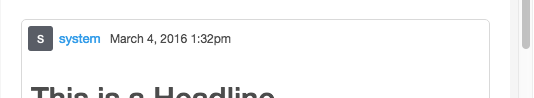
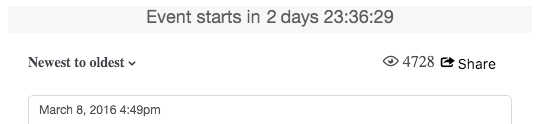
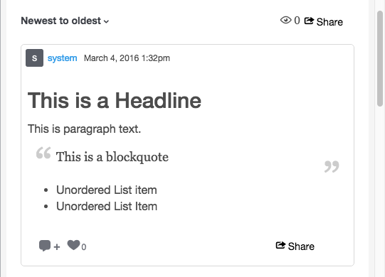
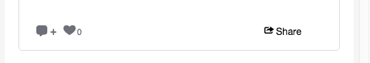

# Storify CSS Classes{#storify-css-classes}

CSS-klasser som är tillgängliga för dina Storify-appar.

Använd CSS för att anpassa Storify-appar för en mer komplett integration med sidan genom att helt enkelt åsidosätta standard-CSS med din egen formatmall. I det här avsnittet beskrivs tillgängliga CSS-anpassningar.

## Författarelement {#section_tdy_hsh_xz}

Här kan du anpassa format för postens författaravatar, författarnamn och tidsstämpel.

| Klass | Beskrivning |
|---|---|
| .s-author-name | Upphovsman |
| .s-author-avatar | Författarens avatar. |
| .s-img | Författarens avatarbild. |
| S-timestamp | Tidsstämpeln för datumet då innehållet bokfördes. |

## Rubrikelement {#section_nbv_gsh_xz}

Här kan du anpassa rubrikavsnittet för artikelsidan.

| **Klass** | **Beskrivning** |
|---|---|
| .super-header | Huvudrubrik |
| .outer-header | Huvudrad 1 |
| .s-nedräkning | Nedräkningstimer för huvudrubrikrad 1 |
| .s-lief | Huvudrubrikrad 1&quot;Live&quot;-status |
| .base-header | Huvudrubrik 2 |
| S-listruta | Huvudrubrikrad 2 Sorteringsutlösare. |
| .s-dropdown-menu | Huvudrubrikrad 2 Sorteringsmeny. |
| .s-dropdown-triangle | Huvudrubrikrad 2 Sortera listruta med cirkumflex. |
| .s-dropdown-option | Huvudrubrikrad 2 Menyalternativ för sortering. |
| S-vyer | Huvudrubrikrad 2 antal vyer. |
| Knappen .s-share-button | Huvudrubrikrad 2 Delningsknapp. |
| .s-share-menu | Huvudrubrikrad 2 Dela-menyn. |

## Publicera element {#section_lrs_fsh_xz}

Här kan du anpassa format för elementen i artikeln.

| **Klass** | **Beskrivning** |
|---|---|
| .s-liveblog | Behållare för hela artikelelementet |
| .s-post | Inläggsbehållaren |
| .s-modal-content | Bokför modal behållare |
| .s-element-content | Alla innehållselement i ett inlägg |
| .s-element-text ul | Textelement |
| .s-element-text h2 | Rubrik för textelement |
| .s-element-text p | Textelementstycke |
| .s-element-text ul | Onumrerad lista för textelement |
| .s-element-text-ol | Numrerad lista för textelement |
| .s-element-text li | Listobjekt för textelement |
| .s-element-text blockquote | Blockcitat |
| .s-element-text blockquote:before | Ikonen för början av ett blockcitat |
| .s-element-text blockquote:after | Ikonen för slutet av ett blockcitat |
| .s-element-image | Elementbehållare för infogad bild |
| .s-img | `` element |
| .s-image-caption | Bildtext för bilder och videor som finns på sociala medier (t.ex.: Instagrambild) |
| .s-upload-image-caption | Bildtext för bilder och videor som överförts via Textbehandlaren |
| .s-element-video | Videoelement |
| .s-element-quote | Offertelement (t.ex.: Tweet (endast med text) |
| .s-element-quote-image | Citat w/image element (ex: Tweet med bild) |
| .s-element-quote-video | Citat w/video element (ex: Tweet med video) |
| .s-link-body | Länka förhandsgranskning inuti en offert (t.ex.: Tweet w/link preview) |

## Sidfotselement {#section_ozc_zrh_xz}

Här kan du anpassa sidfotsavsnittet för varje enskilt inlägg.

| **Klass** | **Beskrivning** |
|---|---|
| .s-post-footer | Postens sidfot. |
| .s-sidenotes a | Knappen Sidenotes i postens sidfot. |
| .s-like | The &quot;Like&quot; button in the post&#39;s footer. |
