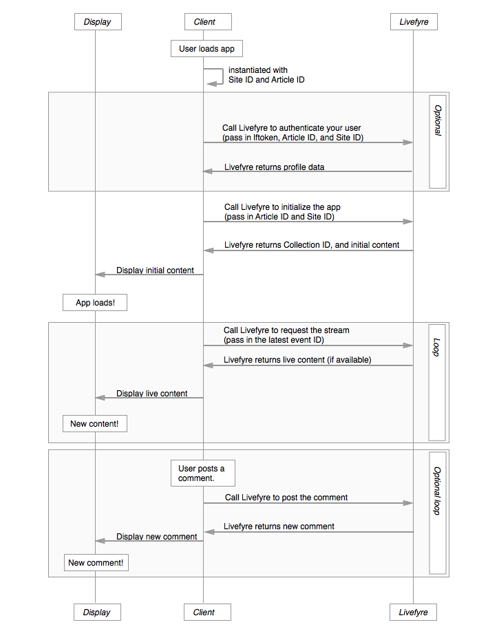

# Arkitektur{#architecture}

Lär dig Livefyre-konventionerna och hur Livefyre ordnar innehållet.

I det här avsnittet finns en översikt över Livefyres nätverksarkitektur.

## Översikt över nätverk och platser

Livefyre organiserar användare och innehåll per nätverk och webbplats. Varje nätverk kan ha ett eller flera användarkonton kopplade till sig och varje nätverk kan innehålla en eller flera Livefyre-platser. En Livefyre-webbplats är en godtycklig gruppering av samlingar. En samling mappar till ett artikel-ID i ditt CMS-system.

## Förstå nätverk {#section_hqt_4m4_xz}

Kunder med flera domäner kan dela användarkonton över alla domäner med ett enda Livefyre-nätverk. Kunder som vill ha separata användarkonton för olika domäner behöver separata Livefyre-nätverk.

Konfigurationsinställningarna kan gälla för platser, nätverk och samlingar (kallas konversation i bilden ovan).

>[!NOTE]
>
>Vissa inställningar är bara tillgängliga på nätverksnivå (till exempel e-postaviseringsinställningar, e-post från adress och anpassade e-postlogotyper). Om du vill att de här inställningarna ska vara olika för varje domän måste du använda flera nätverk.

## Om platser {#section_vjw_nm4_xz}

En webbplats är en godtycklig gruppering av artiklar. Grupperingen är användbar eftersom du kan tilldela olika moderatorer till olika innehållsgrupper. Moderatorer och ägare kan konfigureras för modernt innehåll och konfigurera administratörsinställningar på antingen nätverks- eller webbplatsnivå. Om du vill att vissa moderatorer bara ska se vissa samlingar kan dessa samlingar konfigureras som en separat Livefyre-plats.

>[!NOTE]
>
>Det finns ingen gräns för hur många webbplatser du kan ha i ditt anpassade nätverk.

## Appsekvensdiagram {#section_mw2_lm4_xz}

Oavsett om du vill implementera en anpassad funktion med slutpunkter från Livefyre eller bara behöver felsöka ett problem så är det bra att förstå hur flödet för Livefyres appförfrågningar/svar fungerar.

1. När klienten träffar webbplatsen ska du skapa en instans av Livefyre-appen med plats-ID och artikel-ID.
1. Om du vill autentisera användaren (värdefullt för trafikutvärdering och platsskydd) skickar du webbplatsinformationen Livefyre och token för användarprofil.
1. Skicka Livefyre som plats-ID och artikel-ID för att initiera appen.

   Livefyre returnerar det ursprungliga innehållet.

   Skicka innehållet till sidan och visa appen.

1. Om du vill uppdatera innehåll som visas på sidan skickar du Livefyre det senaste händelse-ID:t från sidan. Om det finns nytt innehåll returneras det.

   Ladda om sidan med nytt innehåll och upprepa processen oändligt.

1. Om du tillåter användare att publicera nytt innehåll utlöser du en händelse när nytt innehåll publiceras på webbplatsen för att publicera innehållet i Livefyre. Livefyre returnerar en uppdaterad ström som du kan använda för att uppdatera webbplatsen.
