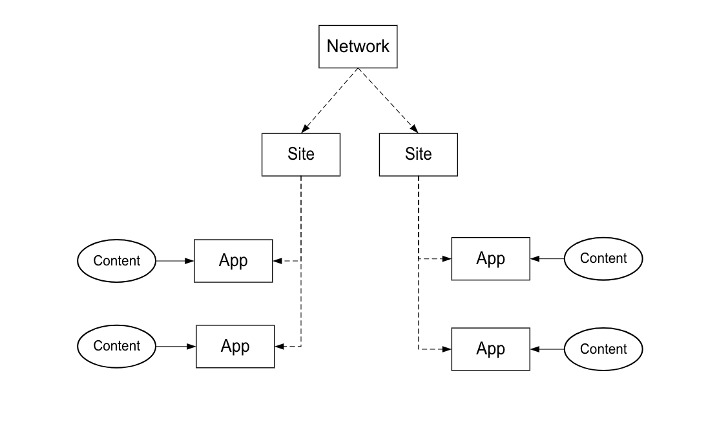

# Implementeringsprocess{#implementation-process}

Hur lång tid du ska implementera Livefyre beror på implementeringen och arbetets omfattning.

## Översikt över Livefyre Network Architecture {#section_dgj_l32_rbb}

Livefyre använder följande termer för att diskutera nätverksarkitektur:

* Nätverk. Den domän på högsta nivån där du tänker använda Livefyre.
* Webbplatser. En underdomän eller ett platsavsnitt som är en del av nätverket.
* Appar. En återgivning av innehåll på din webbplats. Innehållet visas i appar visuellt med hjälp av Visualiseringsappar (Mosaic, Carousel, funktionskort osv.) eller i textformat med hjälp av konversationsappar (kommentarer, granskningar, chatt osv.). Du kan placera en eller flera appar på dina webbplatser.
* Strömmar. Strömmar är filter som söker efter sociala medier och andra webbplatser för att samla innehåll automatiskt för moderering eller direktpublicering i en app.
* Innehåll (till exempel UGC, kommentarer). Vad som visas i apparna. Innehåll kan vara visuellt (till exempel ett foto eller en video), endast ljud eller text.

I följande diagram visas relationen mellan nätverk, platser, appar och innehåll.

Du har en egen Livefyre-instans som är din centrala kontrollpanel för att moderera innehåll, hantera användare och mycket annat. Kontakta din CSM för att få tillgång till din Livefyre-instans.

## Integreringssteg {#section_s2j_d2x_tz}

Det finns tre huvudsteg för att integrera Livefyre:

* Appintegrering

   När du implementerar Livefyre beror implementeringsformatet på ditt användningssätt. För [mer om varje implementeringstyp](/help/implementation/c-getting-started/c-implementation-process/c-app-integration-types.md#c_app_integration_types).

* Autentiseringsintegrering

   Du måste integrera ditt befintliga användarhanteringssystem med Livefyre för konversationsappar och andra appar som kräver slutanvändarautentisering på din webbplats. Om du för närvarande inte använder något användarhanteringsverktyg kan du använda Livefyre-identitet. [Mer information om Livefyre Identity, vad det är och hur du konfigurerar det](/help/implementation/c-livefyre-identity-comp/c-livefyre-identity-comp.md#c_livefyre_identity).

* Anpassning

   Anpassning är valfritt, men de flesta kunder anpassar apparna efter sitt varumärke.
