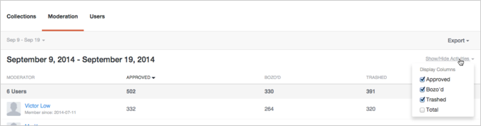
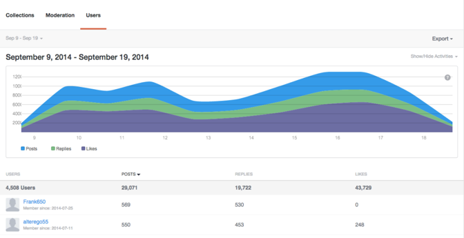

# Analyser{#analytics}

Analysera användare, innehåll och moderatoraktivitet för din webbplats.

## Analyser {#topic_22D8FAE581CD440EA02B1595520F60C2}

Analysera användare, innehåll och moderatoraktivitet för din webbplats.

Med Livefyre Analytics får du tillgång till dina nätverksdata i lättlästa kontrollpaneler för konversationer, moderering och användardata. Använd dessa instrumentpaneler för att övervaka aktiviteten och köra snabba analyser på dina webbplatser.

Instrumentpaneler kan filtreras efter plats, datum och aktivitet. Använd listrutan Nätverk längst upp till vänster i fönstret för att välja en plats som ska visas. När diagrammet har genererats kan du klicka på en kolumnrubrik för att sortera eller för musen över diagrammet för mer specifik information om en datapunkt.

Den här sidan beskriver:

* Välja ett [datumintervall](https://answers.livefyre.com/livefyre-studio-version-1/studio/analytics/#DateRange) för instrumentpanelen
* [Visa/dölja tillgängliga aktiviteter](https://answers.livefyre.com/livefyre-studio-version-1/studio/analytics/#ShowHideActivities)
* [Exporterar instrumentpanelsdata](https://answers.livefyre.com/livefyre-studio-version-1/studio/analytics/#ExportDashboardData)
* [Kontrollpanelen Samlingar](https://answers.livefyre.com/livefyre-studio-version-1/studio/analytics/#CollectionsDashboard)
* [Kontrollpanelen för moderering](https://answers.livefyre.com/livefyre-studio-version-1/studio/analytics/#ModerationDashboard)
* [Kontrollpanelen Användare](https://answers.livefyre.com/livefyre-studio-version-1/studio/analytics/#UsersDashboard)

>[!NOTE]
>
>Analyserna stöder för närvarande aktiviteter som kommer från Livefyres Core Apps och moderation. De flesta aktiviteter som ingår i dessa instrumentpaneler är också tillgängliga via [Livefyre JavaScript Events](https://answers.livefyre.com/developers/reference/app-customizations/javascript-events/), som kan användas som stöd för ditt eget anpassade eller externa analysverktyg.

## Datumintervall {#concept_798C438120E643B6BE262C9997DC87C4}

Klicka på listrutan med datum för att välja ett intervall som ska visas. Använd snabbdatumen eller välj ett start- och slutdatum i de kalendrar som finns.

Snabbdatum:

* **Idag:** Visar data från midnatt på morgonen den aktuella dagen, till den sista fullständiga timmen före den här stunden.
* **I går:** Visar data för föregående 24 timmar.
* **7 dagar:** Visar data för de föregående 7 dagarna, med undantag för idag.
* **30 dagar:** Visar de föregående 30 dagarnas data, förutom idag.
* **Den här veckan:** Visar data från midnatt på morgonen förra söndagen, till den sista fullständiga timmen före denna stund.
* **Den här månaden:** Visar data från midnatt på morgonen den första dagen i den aktuella månaden, fram till den sista fullständiga timmen före den här stunden.
* **Förra veckan:** Visar förra veckans data.
* **Förra månaden:** Visar data för förra månaden.

## Visa/dölja aktiviteter {#concept_022D9851CBCE4A2FB80D0AE52A23744D}

Aktiviteter är åtgärder som användare utför på webbplatsen, inklusive kommentering, flaggning, delning och moderering. Använd listrutan **Visa/dölj aktiviteter** för att välja vilka aktiviteter du vill ska ingå i instrumentpanelen.

>[!NOTE]
>
>Om du väljer nya händelser för filtret återges sidan på nytt utan att URL-adressen ändras.

Vilka aktiviteter som är tillgängliga varierar beroende på kontrollpanelens typ och exportering, och kan omfatta:

* **Inlägg:** Visar data från midnatt på morgonen den aktuella dagen, till den sista fullständiga timmen före den här stunden.
* **Svar:** Visar data för föregående 24 timmar.
* **gilla:** Visar data för de föregående 7 dagarna, med undantag för idag.
* **Ogillar:** Visar de föregående 30 dagarnas data, förutom idag.
* **Innehåller media:** Visar data från midnatt på morgonen förra söndagen, till den sista fullständiga timmen före denna stund.
* **Posten har fotouppladdning:** Visar data från midnatt på morgonen den första dagen i den aktuella månaden, fram till den sista fullständiga timmen före den här stunden.
* **Posten har en länk:** Visar förra veckans data.
* **Inlägget innehåller @omnämns:** Visar data för förra månaden.
* **Godkänd:** Visar data för förra månaden.
* **Bozo&#39;d:** Visar data för förra månaden.
* **Streckad:** Visar data för förra månaden.
* **Moderering totalt:** Visar data för förra månaden.

## Exporterar instrumentpanelsdata {#concept_730DB61A9F894BE6BFB34E0E2A421ED3}

Använd listrutan **Exportera** för att exportera dina instrumentpanelsdata som en CSV-fil.

* Daglig sammanfattning (endast samlingar): exporterar de dagliga tallierna för den senaste fullständiga veckan för varje samling.
* Tabelldata: exporterar alla sammanslagna samlingsdata (alla kolumner och alla rader i den aktuella rapporten).
* Rådata: exporterar alla enskilda händelser som användes för att skapa den aktuella sammanslagna rapporten.

>[!NOTE]
>
>Rapporterna kan ta några minuter att exportera. Alla tidsstämplar är Unix-tid.

## Samlingar {#concept_228D8E5553784DB8BABF3819A5FF0345}

På kontrollpanelen Samlingar visas användaraktivitet per samling, så att du kan avgöra vilket som är det mest (och minst) engagerande innehållet. Varje listad samling innehåller en länk till den sida där den kan hittas.

## Moderering {#concept_98689B1E804B43CEA21E3F456107CCD9}

Kontrollpanelen Moderering visar händelser efter moderator, så att du kan utvärdera deras aktivitet. Använd den här rapporten för att hitta dina mest aktiva moderatorer och deras vanligaste modereringsåtgärder.

>[!NOTE]
>
>Automatiserade Livefyre-modereringsaktiviteter listas för moderatornamnet Livefyre System.

## Användare {#concept_D1A83E31C7B5467F9C844CBF9A740E12}

På kontrollpanelen Användare visas webbplatsaktivitet per användare, vilket gör att du kan analysera hur enskilda användare interagerar med webbplatsen. Använd den här instrumentpanelen för att hitta dina mest aktiva användare på webbplatsen och för att utvärdera de populäraste webbplatsaktiviteterna.

