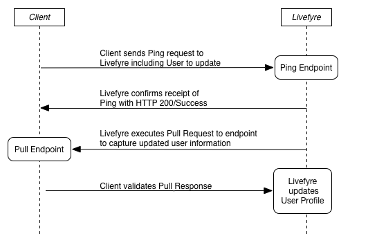

# Synkronisera med Livefyre med Ping för pull{#sync-with-livefyre-using-ping-for-pull}

Använd Ping for Pull för att synkronisera Livefyre med ditt användarhanteringssystem.

I allmänhet ***Ping*** Livefyre när som helst när en användare av din webbplats/app uppdaterar sin profil (visningsnamn, avatar osv.) och Livefyre ***Pulls*** den användarens uppdaterade profil.

Ping for Pull Sequence:

1. Kunden skickar Ping-begäran till Livefyre (inklusive användaren som ska uppdateras).
1. Livefyre bekräftar mottagandet av Ping med HTTP 200/Success.
1. Livefyre-processer Pull-begäran.
1. Livefyre köer Pull-begäran.
1. Livefyre kör pull-begäran till slutpunkten för att hämta uppdaterad användarinformation.
1. Kunden får Pull-svar och validerar.
1. Livefyre uppdaterar fjärrprofiler med den externa profilinformationen som ingår i Pull-slutpunkten.

Ping Livefyre när en användare uppdaterar sin profilinformation. Tiden för slutförande av Ping för Pull kan variera beroende på nätverksbelastning, men användarinformationen uppdateras på mellan 1 och 10 minuter. De uppdaterade profiländringarna visas först i Livefyre Studio > Users.

Den uppdaterade profilinformationen visas i Livefyre-apparna efter två händelser:

* En användare loggar ut och loggar sedan in i appen igen. Visningsnamnvärden i userAuthToken har företräde framför Ping för pull-uppdateringar. En användarutloggning/inloggning uppdaterar token för att uppdatera sessionen.

   Om du vill generera nya userAuthTokens när profilinformationen uppdateras använder du SSO authDelegate för att logga ut användaren och sedan logga in igen i bakgrunden.

* En bootstrap-uppdatering av samlingen kommer att hämta den uppdaterade informationen (högst var 5:10:e minut).

Så här implementerar du Ping for Pull för ditt användarprofilsystem:

1. [Bygg pull-slutpunkten](#t_build_the_pull_endpoint).

   >[!NOTE]
   >
   >Livefyre-biblioteket innehåller en syncUser-metod för att hålla dina användarprofiler uppdaterade. Hoppa över de följande två stegen om du använder Livefyre-biblioteket.

1. [Registrera pull-slutpunkten i Studio](#register_the_endpoint_with_studio).
1. [Bygg Ping](#t_build_the_ping).
1. [Bygg Ping för pull-svar].(#reference_n3x_pzb_mz)
