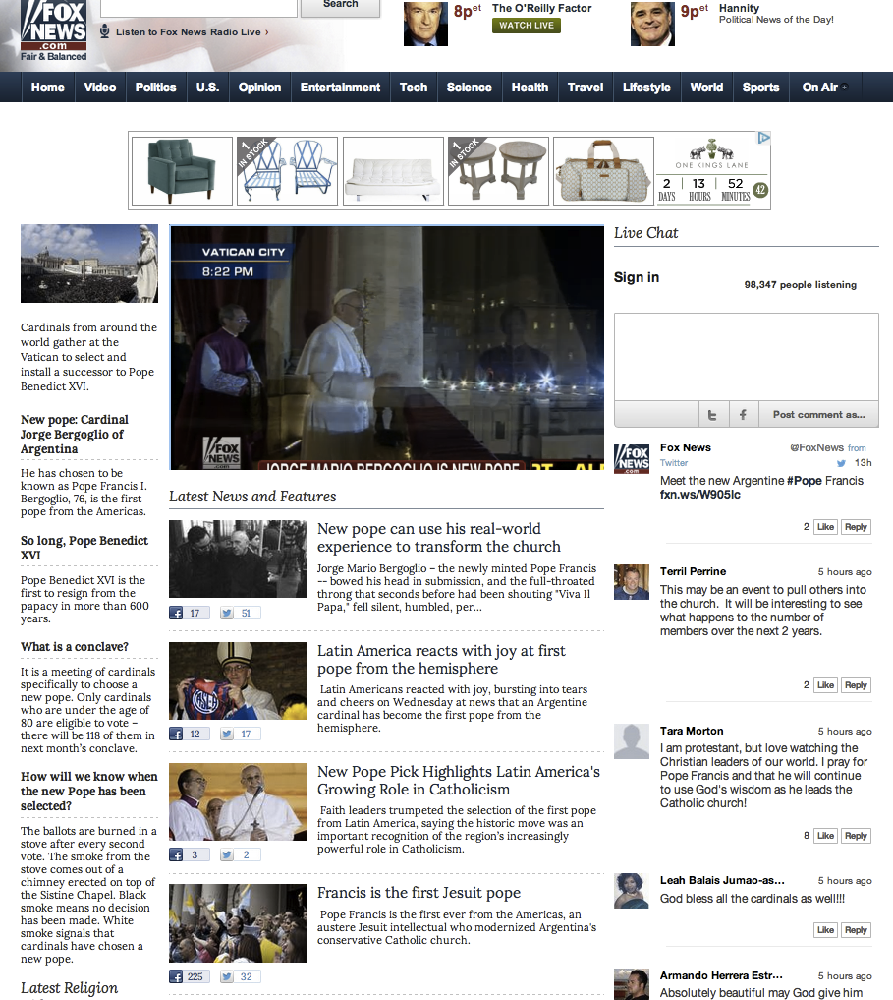

# Chatt{#chat}

Aktivera chatt i realtid på era webbplatser.

Med chatt kan målgrupper engagera sig i realtidskonversationer om live-event, meddelanden och utställningar. Innehåll visas som en kontinuerlig ström av okopplade chattar för att underlätta snabbt engagemang och invigning av aktiviteter på sidan.

Fox News använde Chat för att fånga åskådarnas åsikter och reflektioner kring valet av påven Bergoglio. Fox News visste att det skulle bli en ökning av relevant och aktivt deltagande och lanserade en chatt inom några minuter efter meddelandet för att skapa en direkt konversation.

