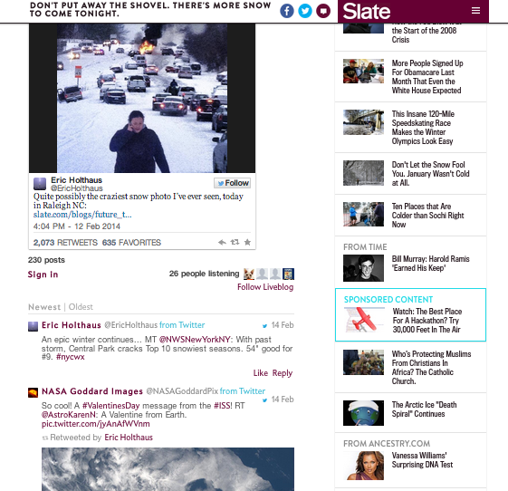

# Live Blog{#live-blog}

Med Live Blog kan skribenter och redaktörer publicera uppdateringar i realtid och omvandla webbplatsen till en engagerande nyhetskälla.

Poster från teamet, med bilder, video, ljud och inbäddat innehåll, blir källan till nya konversationer och trådar. Live Blog är perfekt för produktvisningar, prisutdelningsprogram och idrottsevenemang.

Live-bloggen skiljer sig från kommentarer på följande sätt:

* Endast ägare och moderatorer kan se kommentarsrutan och skapa inlägg på den översta nivån.
* Användarsvar kan inaktiveras för att skapa en upplevelse som bara är för bloggare.
* Användare kan skriva, överföra foton eller publicera inbäddade länkar från sin dator eller mobila enhet.
* Kommentarsteckensnittet är större och avatarerna är mindre för att framhäva innehållet.
* Avatarer kan vid behov inaktiveras.

Nu när en annan snöstorm var på väg ville Slate ge läsarna omedelbara uppdateringar om de vilda vädersvängningarna på östkusten. Med hjälp av en Live-blogg kunde Slate-redigerare omedelbart dela uppdateringar om stormen, inklusive sina egna foton, användartweets och information om snöfallet. Live-bloggen var så användbar att den gjorde förstasidan på Slate:s webbplats.

