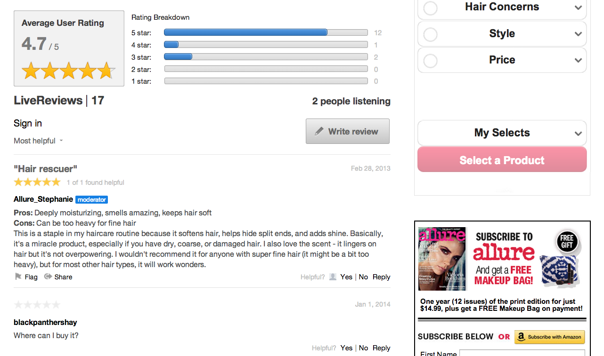

# Recensioner{#reviews}

Betygsätt och granska allt innehåll på er webbplats i realtid.

Granskningar gör det möjligt för användare att enkelt betygsätta och granska produkter, tjänster, artiklar eller annat innehåll på webbplatsen i realtid.

Varje granskning som publiceras i en granskningsapp består av en rubrik på en rad, en brödtext och en numerisk klassificering. Genom att inkludera en titel och en gradering kvantifierar granskningsappen användarens åsikt och ger en sammanfattning av användarens upplevelse av produkten eller tjänsten.

Standardappen för recensioner består av en samling granskningar och ett sammanfattningsavsnitt som visar den genomsnittliga uppdelningen av användaromdömen och omdömen för samlingen. Användarna kan läsa och interagera med granskningarna i realtid.

Allure använder granskningar för att bjuda in sina användare att bidra med omdömen och åsikter om de produkter de har. Med hjälp av granskningar kan Allure samla in värdefulla och personliga användarsynpunkter från sin målgrupp.

## Granskningsfunktioner {#section_awq_xph_21b}

Recensioner innehåller flera funktioner som är specifika för den här appen.

* Snabb visuell representation av trender (stjärngradering och sammanfattning av genomsnittlig klassificering) ovanför flödet.
* Anpassningsbart klassificeringsgränssnitt, inklusive antalet stjärnor och deras bilder, klassificeringsunderdelar (t.ex. för- och efterföljare) och flera betygskategorier.
* Sammanfatta granskningar med en grafisk visualisering av genomsnittlig användarklassificering och klassificeringsfördelning för granskningssamlingen.
* Köa granskningar som ska visas, samtidigt som du behåller användarens granskning överst i listan för att visa dem.
* Låt användarna rösta om granskningarnas användbarhet och sedan sortera efter Mest användbar och/eller Högsta klassificering.
* Mobilvänligt gränssnitt.
