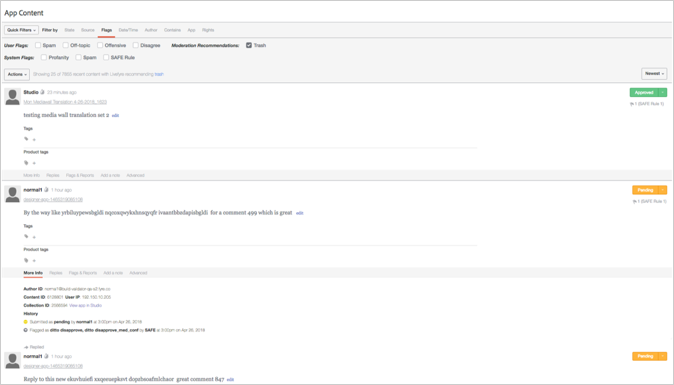
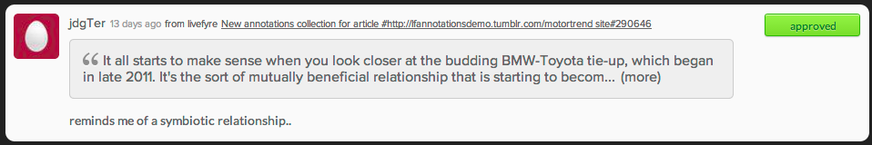

# Moderera innehåll med appinnehåll{#moderate-content-using-app-content}

På fliken Appinnehåll i biblioteket kan du moderera innehåll som publiceras i olika appar.

## Modernt innehåll {#section_md5_sqm_zz}

Använd panelen Appinnehåll för att moderera innehåll i listan genom att ändra dess status, ändra status för författaren eller lägga till en anteckning. Om du vill moderera innehållet för du musen över det listade innehållet för att ändra tillgängliga markörer, eller använder menyn för att ändra status för ett eller flera markerade innehåll. **[!UICONTROL pulldown]**

I appinnehåll kan du:

* **[!UICONTROL Tag Content]**. Välj **[!UICONTROL Tag Content]** om du vill lägga till taggar i enskilda eller flera innehållsdelar samtidigt.

* **[!UICONTROL Ignore Flags]**. Välj **[!UICONTROL Ignore Flags]** att exkludera markerat innehåll från flaggade sökfilterresultat. Att markera **[!UICONTROL Ignore Flags]** för en artikel påverkar inte objektets status; den tas helt enkelt bort från sökresultaten för sökfiltret framåt för alla Studio-användare.

* **[!UICONTROL Change Content Status]**. Klicka på en del av innehållet och använd sedan **[!UICONTROL Actions]** menyn för att ändra dess status. (Använd kommando- eller kontrolltangenten för att markera flera alternativ och använd sedan menyn för att ändra status för flera innehållsdelar samtidigt.)

   Alternativen varierar beroende på det aktuella läget för det listade innehållet.

   | Aktuellt läge | Kan ändras till |
   |---|---|
   | Godkänd | Väntande, papperskorg, Bozo |
   | Bozo | Godkänt, Väntande, Papperskorgen |
   | Papperskorgen | Godkänd, Väntande, Bozo, Ta bort |
   | Väntande | Godkänd, Papperskorgen, Bozo |

* **[!UICONTROL Save as Assets]**. Välj **[!UICONTROL Save as Assets]** att öppna dialogrutan Avancerade alternativ där du kan spara de markerade objekten i ditt resursbibliotek, publicera dem i en app eller begära återanvändningsbehörighet från författaren.

* Måttligt baserat på rekommendationer. Använd alternativet **[!UICONTROL Moderation Recommendation Indicator]** i appinnehåll för att filtrera innehåll som modereringsrekommendationen identifierar som sannolikt kommer att bli hashas.

   I appinnehåll ser modereringsrekommendationerna ut så här:  

## Modernt innehåll för sidobjekt {#section_i2s_nqm_zz}

Att arbeta med sidotecken på panelen Innehåll skiljer sig från att arbeta med andra typer av innehåll på flera sätt:

* Flikarna Mer info, Svar, Flaggor och rapporter och Lägg till anteckning är inte tillgängliga.
* Du kan inte tagga sidobjekt eller markera det som Aktuellt.

Den skiljer sig också åt genom att den inte bara visar det innehåll som ska modereras. den text som valdes när Sidenote lades till visas också, så att du kan utvärdera innehållet i sitt sammanhang.

Klicka på textrutan för att expandera den så att den innehåller hela den offert som användaren har valt.

Sidenotes content moderation allows both bulk changes, and individual status changes, as shown above.

## Moderera Livefyre-användare {#section_grw_mqm_zz}

För musen över användarnamnet för en Livefyre-användare för att öppna en pulldown-meny, som gör att du kan **[!UICONTROL Ban the User]** hämta **[!UICONTROL More Info]** eller visa en lista över deras **[!UICONTROL Comments]**. Om du klickar på den här menyn öppnas användarens informationskort på Studios **[!UICONTROL Users]** sida.

Mer information om hur du modererar användare på **[!UICONTROL Users]** sidan finns i [Moderate Users ModQ](/help/using/c-features-livefyre/c-about-moderation/t-moderate-users-modq.md#t_moderate_users_modq).
