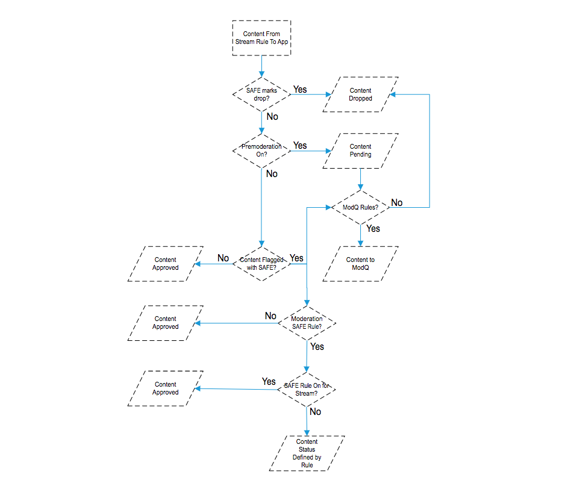
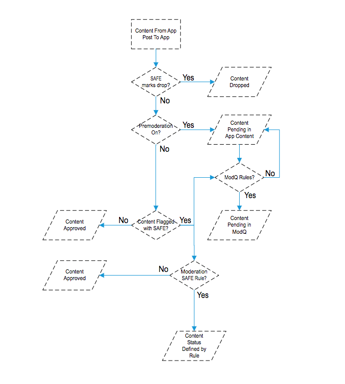
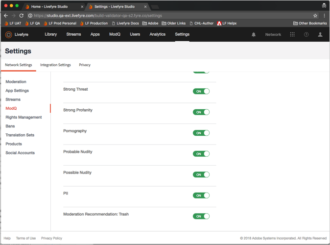
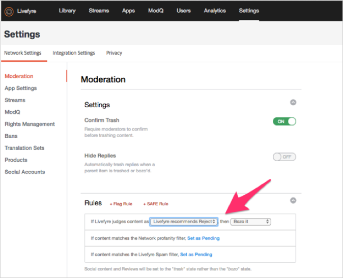
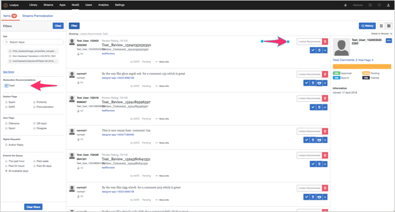
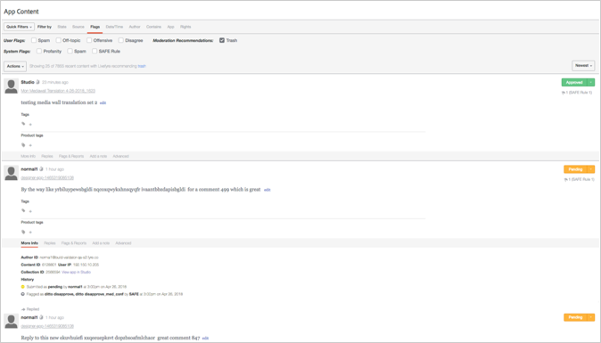

# Ställa in moderering{#setting-up-moderation}

Använd fliken Moderation för att ange förhandsmodereringsregler för inkommande innehåll, inklusive avstavningslistor, flaggregler och förbjudna IP-adresser.

## Hur moderering fungerar {#section_kyf_gvc_t1b}

Du kan moderera innehåll på följande sätt:

* Förmoderera automatiskt innehåll för att filtrera bort oönskat innehåll baserat på de regler du ställt in innan du publicerar innehållet.
* Ta bort eller godkänn innehåll som har flaggats manuellt med den automatiska förmodereringen med ModQ eller App Content i biblioteket.
* Identifiera webbplatsbesökare som upprepade gånger publicerar stötande innehåll för att hindra dem från att publicera genom att förbjuda specifika Livefyre-användare, sociala användare eller IP-adresser.
* Identifiera personer och innehåll som alltid kan visas genom att tillåta listning av användare eller stänga av filter för specifika strömmar, webbplatser eller nätverk.

Du kan förmåtta innehåll automatiskt på följande sätt:

* Ange regler för att automatiskt flagga vissa typer av innehåll:

   * Ange flaggregler för innehåll som flaggas av webbplatsens besökare med **[!UICONTROL Settings > Moderation > Rules]**
   * Konfigurera SAFE-regler med **[!UICONTROL Settings > Moderation > Rules]**
   * Förbjud specifika Twitter-användare att använda **[!UICONTROL Settings > Streams]**
   * Förhindra IP-adresser med **[!UICONTROL Settings > Bans]**
   * Förbjud IP-regioner per landskod på begäran. Bannlyst innehåll markeras som SPAM.

* Skapa en lista med ord som du betraktar som svordomar i Profanity List under **[!UICONTROL Settings > Moderation > Rules]** for your Network or Site.
* Tillåt listanvändare (tillåt alltid att innehåll från dessa användare visas) genom att använda eller inaktivera filter för specifika strömmar, webbplatser eller nätverk.

När du har konfigurerat dina svordlistor, SAFE-filter och regler kan du välja om du vill använda förmåttligt innehåll och SAFE-filter i strömmar. Mer information finns i Alternativ för [direktuppspelningsregel för alla direktuppspelningsregler](/help/using/c-streams/c-stream-rule-options-for-all-stream-rules.md#c_stream_rule_options_for_all_stream_rules).

Livefyre markerar innehåll som **[!UICONTROL Approved]**, **[!UICONTROL Pending]**, **[!UICONTROL Junk]** osv. beroende på varifrån innehållet kommer, var det kommer att publiceras och vilka regler du har konfigurerat i systemet. I följande tabell beskrivs de åtgärder som Livefyre vidtar, beroende på dessa faktorer, i detalj.

## Hur moderering fungerar

| Innehållet kommer från: | Skicka innehåll till: | Godkännandestatus |
|--- |--- |--- |
| Bibliotek | App | Godkänt innehåll |
| Social sökning | App | Godkänt innehåll |
| Strömregel | App | Är innehåll markerat som skräppost av SAFE-filter?  <ul><li>Nej - modereringsarbetsflöde från ström till app</li><li>Ja - innehållet traschat</li></ul> |
| Bibliotek | Mapp | Ingen status (i mappen, inte publicerad, inte traschad) |
| Social sökning | Mapp | Ingen status (i mappen, inte publicerad, inte traschad) |
| Strömregel | Mapp | Är innehåll markerat som skräppost av SAFE-filter?  <ul><li>Nej - Ingen status (i mapp, inte publicerad, inte traschad)</li><li>Ja - innehållet traschat</li></ul> |
| Appinlägg | App | Är innehåll markerat som skräppost av SAFE-filter?  <ul><li>Nej - modereringsarbetsflöde efter app</li><li>Ja - innehållet traschat</li></ul> |

## Arbetsflöde för moderering från ström till app {#section_z5z_w4d_t1b}

Innan innehållet från en direktuppspelning publiceras till en app utför Livefyre följande kontroller för att avgöra vad som ska göras med innehållet:

1. Om SAFE flaggar innehållet som skräppost eller släppt, kraschar Livefyre innehållet.
1. Om SAFE inte flaggar innehållet som skräppost kontrollerar Livefyre om förmoderering är aktiverat.
1. Om du aktiverar förmoderering markeras innehållet som väntande.
1. Om du konfigurerar ModQ-regler skickar Livefyre innehållet till ModQ.
1. Om du inte har aktiverat förmoderering kontrollerar Livefyre om innehållet har flaggats som SAFE.
1. Om SAFE flaggade innehållet godkänner Livefyre innehållet och publicerar det i appen.
1. Om SAFE flaggar innehållet och du inte konfigurerade SAFE-regler, godkänner Livefyre innehållet och publicerar innehållet till appen.
1. Om SAFE flaggar innehållet och du ställer in SAFE-regler, kontrollerar Livefyre om du ställer in SAFE-regler för strömmen.
1. Om du ställer in SAFE-regler för direktuppspelningen godkänner Livefyre innehållet och publicerar innehållet i appen. Om du inte har konfigurerat SAFE-regler för strömmen använder Livefyre de modererade SAFE-reglerna för att avgöra hur innehållet ska hanteras (skicka till ModQ, papperskorgen osv.).

## Arbetsflöde för moderering efter app {#section_fwn_w4d_t1b}

Innan innehållet från ett appinlägg publiceras i en app utför Livefyre följande kontroller för att avgöra vad som ska göras med innehållet:

1. Om SAFE-filtret flaggar innehållet som släppt, släpper Livefyre innehållet.
1. Om SAFE inte flaggar innehållet som släppt kontrollerar Livefyre om det är aktiverat för förhandsmoderering. Om du aktiverar förmoderering markeras innehållet som väntande. Om du konfigurerar ModQ-regler skickar Livefyre innehållet till ModQ som oförändrat. Om det inte är det förblir innehållet i en väntande status i App Content i Library.
1. Om du inte har aktiverat förmoderering kontrollerar Livefyre om innehållet har flaggats som SAFE. Annars godkänner Livefyre innehållet och publicerar innehållet i appen.
1. Om SAFE flaggar innehållet och du ställer in SAFE-regler, använder Livefyre SAFE-regeln för att avgöra hur innehållet ska hanteras (skicka till ModQ, papperskorgen osv.). Om SAFE flaggar innehållet och du inte konfigurerade SAFE-regler, godkänner Livefyre innehållet och publicerar innehållet till appen.

## Massfilter {#section_lyk_ktx_vy}

Filtret Massor letar efter upprepat innehåll som publicerats i alla Livefyre-nätverk inom en kort tidsram. Om det upptäcks flaggas det här innehållet som massutskick och sedan som standard trash. Massinnehåll kan genereras av användaren (t.ex.&quot;Touchdown!&quot;) som publicerats upprepade gånger i en chatt under ett populärt fotbollsspel) har de flesta sitt ursprung i skräppostkampanjer. Det här filtret är språkoberoende och fungerar med alla språk. Om du vill anpassa gruppfiltret måste du kontakta Livefyre support.

## Regler {#section_gqz_ksk_f1b}

Använd avsnittet Regler för att skapa regler för förmoderering som baseras på SAFE och flaggor som används av användare. På den här panelen finns två typer av regler:

* **[!UICONTROL Flag Rules:]** Ange en åtgärd som ska utföras på en kommentar som flaggats av användare ett visst antal gånger.
* **[!UICONTROL SAFE Rules:]**kombinerar SAFE-flaggor med åtgärder som kan vidtas för det flaggade innehållet.

Om du vill skapa flaggregler markerar du flaggan (stötande, Ämne, Ogilla eller Skräppost), anger hur många gånger den måste användas på ett visst innehåll och väljer den åtgärd som ska utföras. Du kan ange en flaggregel för varje flaggalternativ (stötande, Från ämne, Ogilla eller Skräppost).

Du kan skapa regler på nätverks-, webbplats- och direktuppspelningsnivå. Regler på webbplatsnivå ärver nätverksregler, såvida du inte konfigurerar platsregler på ett annat sätt. Direktuppspelningsregler ärver platsregler såvida du inte konfigurerar dem på ett annat sätt.

Tillgängliga åtgärder:

* **[!UICONTROL Trash it:]**skickar den flaggade kommentaren till papperskorgen.
* **[!UICONTROL Bozo it:]** Döljer den flaggade kommentaren från alla användare, förutom författaren, som den förblir synlig för.
* **[!UICONTROL Pending:]** anger innehållet som väntande. Om du ställer in Förhandsmoderering på ON under **[!UICONTROL Settings > ModQ]** kommer det att vara i ModQ. I annat fall visas det bara i appinnehåll.

>[!NOTE]
>
>Livefyre rekommenderar att du skapar regler för Bozo-kommentarer som flaggas som skräppost eller stötande av fem användare.

## Rekommendationer om moderering {#section_ec3_vr3_2cb}

Du kan använda modereringsrekommendationer för att avgöra hur modererat innehåll som publiceras av webbplatsbesökare i Livefyre-appar ska hanteras. Rekommendationsindikatorn för moderering rekommenderar när det är troligt att en del av innehållet kommer att spåras, baserat på vilka åtgärder du tidigare vidtagit för liknande innehåll. Så här använder du modereringsrekommendationer:

1. Aktivera funktionen för modereringsrekommendationer genom att kontakta supportpersonalen på Adobe Livefyre.
1. Ställ in modereringsrekommendationer i Nätverksinställningar.

   Ställ in modereringsrekommendationer med hjälp av inställningen under **[!UICONTROL Livefyre Recommends Trash]****[!UICONTROL Network Settings]**.

   

1. Konfigurera en SAFE-regel för att tala om för Livefyre vad du ska göra med innehåll som identifieras i modereringsrekommendationen som innehåll som sannolikt kommer att trasseras. Mer information om hur du ställer in en SAFE-regel för **[!UICONTROL Livefyre Recommends Trash]** alternativet finns i [Moderering](/help/using/c-features-livefyre/c-about-moderation/c-moderation.md#c_moderation).

   

1. Använd alternativen **[!UICONTROL Moderation Recommendation Indicator]** i ModQ eller i Programinnehåll för att filtrera innehåll som enligt modereringsrekommendationen sannolikt kommer att bli genomstruken.

   I ModQ ser indikatorn ut så här:  

   Mer information om hur du använder modereringsrekommendationer för måttligt innehåll i ModQ finns i [ModQ](/help/using/c-features-livefyre/c-about-moderation/c-modq.md#c_modq).

   I appinnehåll ser modereringsrekommendationerna ut så här:  

   Mer information om hur du använder modereringsrekommendationer i appinnehåll finns i [moderera innehåll med appinnehåll](/help/using/c-features-livefyre/c-about-moderation/c-moderate-content-using-app-content.md#c_moderate_content_using_app_content).
