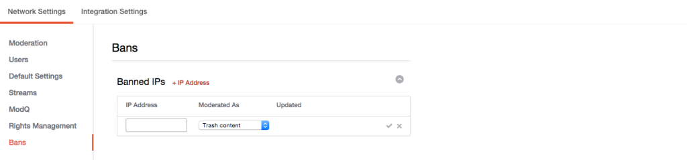

# Förbjuden IP-adress{#ban-ip-addresses}

Du kan förbjuda IP-adresser om en oärlig användare skapar flera konton från samma IP-adress.

Om en bannlyst användare börjar inse att ingen ser sina kommentarer, kan de välja att skapa ett nytt användarkonto med ett annat användarnamn och en annan avatar och börja lägga in olämpliga eller skräppost från det nya, oförbjudna kontot. Moderatorerna kan känna igen innehållet som samma användare och verifiera antagandet genom att kontrollera IP-adressen för den användare som publicerar kommentarerna (från sidan Kontoinformation).

1. Klicka på **[!UICONTROL + IP Address]** på panelen Banned IPs.
1. Ange IP-adressen i fältet. Om du vill blockera ett intervall med IP-adresser anger du intervallet i formatet &quot;192.168.0.1 - 192.168.0.10&quot; (separera IP-adresserna med blanksteg och ett bindestreck inom citattecken) och klickar på **[!UICONTROL Save]**.
1. Välj en åtgärd på menyn (Papperskorg, Förmåttligt eller Bozo-innehåll).
1. Klicka på bockmarkeringen för att spara.
