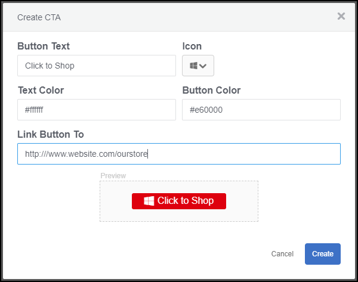
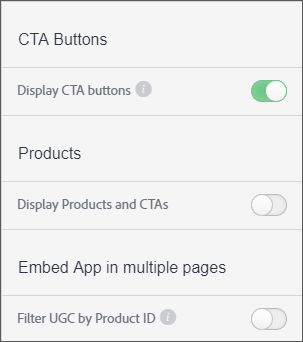

# Anpassad knapp för att ringa till åtgärd{#custom-call-to-action-button}

## Anpassad knapp för att ringa till åtgärd {#topic_EBE23A0F827645E0A0C619DCF3872EE5}

Anpassade CTA-knappar (Call-to-Action) är knappar som kan läggas till i alla resurser i Livefyre Studio för att göra innehållet användbart. De kan hänvisa en slutanvändare till en anpassad URL, t.ex. en sida för sociala medier eller en kundvagn. CTA-knappar kan skapas på flera platser i Livefyre, men de hanteras i **[!UICONTROL Settings]**-avsnittet i Livefyre Studio.

Med anpassade CTA:er kan man

* Lägg in egna CTA-knappar i valfri UGC-enhet i Livefyres medieväggar, mosaik, karuseller, filmremsor och på individuella funktionskort.
* Ha kontroll över meddelande, ikoner, färger, länkar och antal knappar på varje del av UGC.
* Skapa, hantera och återanvänd anpassade CTA-knappar inifrån Inställningar och Biblioteket.
* Använd Adobe Analytics för att mäta klickfrekvensen.

## Skapa en anpassad knapp för att ringa till åtgärd {#task_C61B4A8E66F24AC19C833612E596B736}

Aktivitetskontext

1. Klicka på **[!UICONTROL Settings]** i Livefyre Studio.
1. Klicka på **[!UICONTROL CTAs]** i den vänstra listen.

   CTA-biblioteket visas, där CTA kan skapas och ordnas i mappar. 1. Klicka på **[!UICONTROL Create CTA]**.
1. Fyll i fälten med de önskade anpassningarna och en knappförhandsgranskning visas längst ned på skärmen Skapa CTA.

   

1. Klicka på **[!UICONTROL Create]**.

   Knappen CTA är nu tillgänglig och kan läggas till i alla resurser.

## Lägg till en anpassad Call-to-action-knapp till en resurs {#task_36190DD1C8204C7793CB7EEA379C2155}

Lägg till en CTA-knapp till valfritt innehåll i Livefyre Studio.

1. I Livefyre studio går du till **[!UICONTROL Library]** > **[!UICONTROL All Assets]**.
1. Välj en eller flera resurser där du vill lägga till en CTA-knapp.
1. Klicka på **[!UICONTROL CTAs]**.

   

1. Välj önskad CTA-knapp i listan och klicka sedan på **[!UICONTROL Add]**.

   CTA-knappen visas nu för den valda resursen.

   >[!NOTE]
   >
   >För att de anpassade CTA-knappar som du associerar med varje resurs ska kunna visas i en app måste du aktivera CTA-knappar i appinställningarna:
   >
   >
