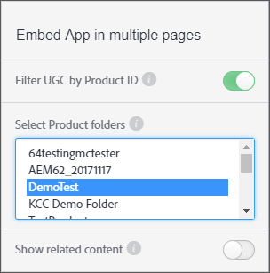

# Filtrera UGC efter produkt-ID {#filter-ugc-product-id}

Genom att filtrera UGC efter produkt-ID kan du bädda in exakt samma app på flera sidor samtidigt som du visar olika produktspecifika UGC för varje sida.

Så här filtrerar du UGC efter produkt-ID:

1. Gå till fliken **[!UICONTROL Apps]** i Livefyre Studio.

1. Välj det program som du vill ändra.

1. Välj fliken Designer i den vänstra listen.

1. Aktivera **[!UICONTROL Filter UGC by Product ID]**.



1. Välj de produktmappar på den översta nivån som innehåller produkten eller produkterna som du vill filtrera UGC efter.
Använd Ctrl/Kommando + klicka för att markera flera mappar.

1. Inaktivera **[!UICONTROL Show related content]**.
När det här alternativet är aktiverat visas innehåll som filtreras med attributet `data-lf-attr-product` först, följt av allt annat innehåll i programmet.

1. Klicka på **[!UICONTROL Publish]**.

1. Infoga de produkt-ID som du vill filtrera efter i den resulterande koden.

>[!NOTE]
>
>Navigera till **[!UICONTROL Settings > Products]** för att hitta produkt-ID:n. Leta upp önskad produkt och markera den så visas ID:t.

Följande kod genereras till exempel för en medieväggsapp:

```
<script type="text/javascript" src="https://cdn.livefyre.com/
Livefyre.js"></script><div class="lf-app-embed" data-lfapp="
59dc41fa-85a5-49ed-8d60-d74616b3ccd1/tagged/published" datalf-
env="prod" data-lf-read-only="" data-lf-attr-product="<product
 1>,<product 2>"></div><script>Livefyre.require(["app-embed#1.0.11"],
 function (appEmbed) {appEmbed.loadAll().done(function(embed)
 {embed = embed[0];if (embed.el.onload && embed.getConfig)
 {embed.el.onload(embed.getConfig());}});});</script>
```

Om du vill tagga en produkt ersätter du `<product 1>` i attributet `data-lf-attr-product` med det önskade produkt-ID:t. Du kan tagga en produkt eller flera genom att lägga till ytterligare kommaseparerade produkt-ID:n. Produkterna måste finnas i den eller de produktmappar på den översta nivån som valts i steg 5.

Det ändrade kodsegmentet ser ut som:

```
<script type="text/javascript" src="https://cdn.livefyre.com/
Livefyre.js"></script><div class="lf-app-embed" data-lfapp="
59dc41fa-85a5-49ed-8d60-d74616b3ccd1/tagged/published"
 data-lf-env="prod" data-lf-read-only="" data-lf-attrproduct="
109,47"></div><script>Livefyre.require(["app-embed#1.0.11"],
 function (appEmbed) {appEmbed.loadAll().done(function(embed)
 {embed = embed[0];if (embed.el.onload && embed.getConfig)
 {embed.el.onload(embed.getConfig());}});});</script>
```

Programmet visar nu bara de taggade produkt-ID:n.
