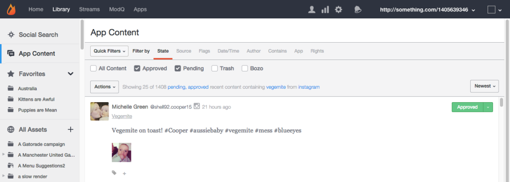
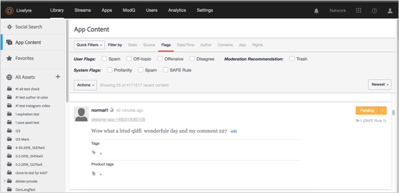
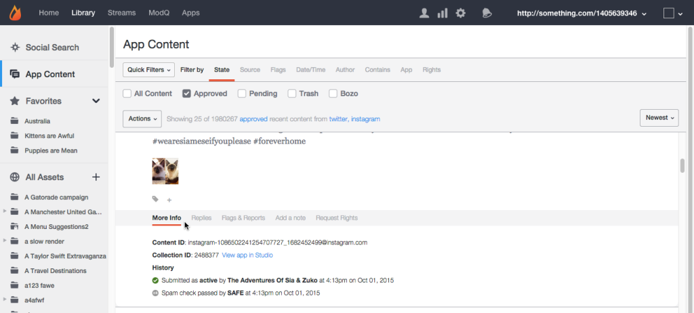
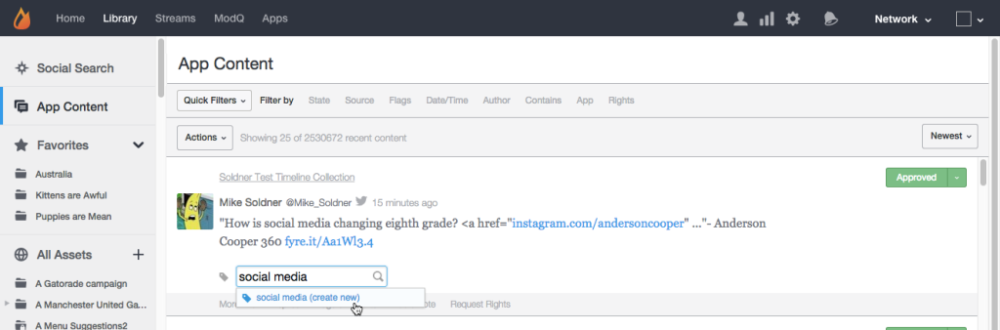

# Fliken Appinnehåll{#app-content-tab}

Hantera innehåll i Livefyre-nätverket.

På fliken Appinnehåll i biblioteket kan du söka efter och moderera innehåll som publicerats i olika appar. På fliken **[!UICONTROL App Content]** kan du använda flera sökfilter med jokertecken för att snabbt och enkelt definiera sökparametrar.

Använd fliken Appinnehåll för att:

* Sök efter innehåll
* Visa innehållshistorik
* Modernt innehåll
* Lägg till en tagg
* Innehåll
* Associera innehåll med produkter från produktkatalogen

Mer information om hur du modererar innehåll med fliken App Content finns i .

## Sökning med jokertecken {#section_jvr_ntm_zz}

Livefyre-sökfält har stöd för jokertecken, som gör att du kan lägga till en asterisk ( * ) till ord (eller ordfragment) för att fånga partiella matchningar.

Exempel:

* ball returnerar bara ball
* ball* returnerar boll och ballong
* *ball returns ball and ball
* *ball* returnerar ball och uniball samt snöballad

## Sök efter innehåll {#section_fw1_mtm_zz}

På panelen Appinnehåll kan du begränsa sökningen med hjälp av flera olika alternativ för innehållsfiltrering.

Använd pulldown- **[!UICONTROL Quick Filters]** funktionen för att begränsa returnerat innehåll till **[!UICONTROL All Content]**, **[!UICONTROL All Sidenotes]**, **[!UICONTROL Approved]**, **[!UICONTROL Approved & Flagged]** eller **[!UICONTROL Pending]****[!UICONTROL Rights Requests]** status. Välj sedan ett **[!UICONTROL Filter by]** alternativ och använd de kryssrutor eller inmatningsfält som är tillgängliga för att begränsa sökningen.

Använd menyn för att sortera innehållet i listan efter **[!UICONTROL Newest]**, **[!UICONTROL Oldest]**, **[!UICONTROL Recently updated]** eller **[!UICONTROL Most flags]** **[!UICONTROL Most liked]**.

## Filtrera efter alternativ {#section_aqn_xqm_zz}

Använd **[!UICONTROL Filter by]** fältet för att filtrera efter följande alternativ:

* **Läge** Används för att filtrera efter innehållets aktuella modereringstillstånd:** [!UICONTROL All Content]**, **[!UICONTROL Approved]**, **[!UICONTROL Pending]** eller **[!UICONTROL Bozo]**.

* **Källa** Används för att filtrera efter innehållets källa. Välj **[!UICONTROL Livefyre]** om du vill visa användargenererat innehåll som publicerats direkt i strömmen. Välj **[!UICONTROL Facebook]**, **[!UICONTROL Twitter]** eller **[!UICONTROL RSS]** för att inkludera innehåll som hämtas till dina appar från dessa källor.

* **Med flaggor** som markerar flaggor kan du filtrera efter **[!UICONTROL User Flags]** (skräppost, ämne, stötande eller ogilla), som används av SAFE (Profanity, Spam eller Magically Moderated) eller **[!UICONTROL System Flags]** **[!UICONTROL Moderation Recommendations]**. 

* **Datum/tid** Används för att filtrera efter när innehållet ursprungligen skapades **[!UICONTROL Created]** (eller hämtades till appen via SocialSync eller en direktuppspelning) eller senast **[!UICONTROL Modified]** (redigerades, flaggades eller läget ändrades).

* **Författare** Används för att filtrera efter författarens **[!UICONTROL IP]** adress, **[!UICONTROL Display Name]** (finns på panelen Användare eller ovanför det innehåll som författaren har publicerat) eller **[!UICONTROL User ID]**(finns på panelen Användare).

* **Innehåller** Gör att du kan filtrera de senaste 90 dagarnas innehåll efter **[!UICONTROL Keyword]** eller **[!UICONTROL Content Tag]**. Markera **[!UICONTROL Media]** kryssrutan om du bara vill returnera innehåll som innehåller media. (Om du vill söka efter allt innehåll bläddrar du nedåt genom allt innehåll i listan och klickar sedan på **[!UICONTROL Search full data]**.)

   **Obs!** Det går inte att söka efter flera nyckelord och innehållstaggar. Om du anger flera nyckelord eller taggar används det sista ordet i sökningen.

   När du söker efter innehållstagg fylls de föreslagna taggarna i automatiskt när du skriver i sökfältet. Sökresultaten returnerar allt innehåll som någonsin har tilldelats taggen. (Använd det här fältet om du vill söka efter Aktuellt innehåll eller klicka på etiketten för något av det innehåll som finns i Studio.) **[!UICONTROL Featured]**

   **Obs!** Använd ett minustecken (-) före ett taggnamn om du vill söka efter innehåll som inte innehåller den taggen. Till exempel: Sök efter&quot;-Miley&quot; om du vill söka efter allt innehåll som inte innehåller&quot;Miley&quot;-taggen.

* **App** Används för att filtrera efter **[!UICONTROL Collection ID]**, **[!UICONTROL App Tag]** eller **överordnat ID**. Filtrering med överordnat ID returnerar allt innehåll som är ett svar på inmatat innehålls-ID. (Filtrera efter flera taggar genom att ange taggar avgränsade med kommatecken.)

* **Rättigheter** Gör att du kan filtrera efter rättighetsbegärandestatus:** [!UICONTROL Requested]**, **[!UICONTROL Granted]**, **[!UICONTROL Replied]** eller **[!UICONTROL Expired]**.

## Bozo-innehåll {#section_afl_vqm_zz}

I Appar visas **[!UICONTROL Bozo]** bara innehållet för den som skapat innehållet. På så sätt kan användaren tro att deras innehåll har godkänts, samtidigt som det döljs för alla andra användare och moderatorer.

>[!NOTE]
>
>Socialt innehåll som kommer från SocialSync eller Streams **[!UICONTROL cannot]** anges till Bozo.

Du kan använda Bozo-innehåll av följande skäl:

* Innehåll som identifieras som spam av SAFE anges automatiskt till Bozo-läge.
* Allt innehåll från Banned Users anges automatiskt till Bozo.
* Innehåll kan vara märkt med Bozo från Studio.
* Moderatorer kan ha Bozo-innehåll direkt i strömmen.

## Visa innehållshistorik {#section_ayz_tqm_zz}

På innehållspanelen kan du granska historiken för allt innehåll i listan, inklusive förmoderering, skräppostfiltrering, publiceringsdatum och eventuella användarflaggor eller anteckningar som har tilldelats objektet.

Använd flikarna längst ned på innehållspanelen för att visa historiken.

* **[!UICONTROL More Info:]** innehåller en lista över all aktivitet i det här innehållet, inklusive överföring, redigering, skräppostkontroll, tillståndsändring och anteckningar. Livefyres innehålls-ID och användarens IP-adress visas också i det här avsnittet.
* **[!UICONTROL Replies:]** innehåller högst sex svar. Klicka **[!UICONTROL Show all replies]** för att visa alla svar på inlägget.

* **[!UICONTROL Flags & Reports:]** visar alla användarflaggor, med avataren för den användare som flaggade innehållet och alla rapporter (anteckningar som lades till av användaren när innehållet flaggas).
* **[!UICONTROL Add a note:]** gör att du kan lägga till en anteckning som är synlig för andra administratörer eller moderatorer.
* **[!UICONTROL Request Rights:]** öppnar den **[!UICONTROL New Rights Request]** dialogruta från vilken en rättighetsbegäran kan utfärdas.

* **[!UICONTROL Save as Asset:]**öppnar **[!UICONTROL Advanced Options]** dialogrutan där du kan spara det markerade objektet i ditt resursbibliotek, publicera det i en app eller begära återanvändningsbehörighet från författaren.

## Lägga till en tagg i innehållet {#section_xb4_mxr_rdb}

Genom att tagga innehåll kan du kategorisera och ordna innehåll för enkel hämtning och anpassning av format, eller markera innehåll som det är.

Om du vill lägga till taggar klickar du bara på plusikonen ( **[!UICONTROL +]**) under innehållet. Ange en ny tagg eller välj i en lista med befintliga taggar.

## Söka efter bilder i alla resurser {#section_zxf_hsf_wcb}

När du har lagt till innehållet i biblioteket kan du söka efter innehåll med smarta taggar.

I biblioteket under Alla resurser kan du söka efter befintliga bilder genom att klicka på **[!UICONTROL Show Filters]** och sedan:

* Ange text att söka i sökfältet
* Sortering efter relevans
* Ange text i **[!UICONTROL Tags]** fältet som du vill söka efter med smarta taggar. Rankningsalgoritmen för smarta taggar filtrerar innehåll med hjälp av ett smart kodkonfidensresultat, hur nytt innehållet är och hur många stjärnor en användare gav innehållet.

## Innehåll {#section_emb_kqm_zz}

Markera standardtaggen **[!UICONTROL Featured]** för att markera innehållet som aktuellt och markera det som viktigt för användarna. När du har taggat det kan du använda anpassade formateringsalternativ för att anpassa det aktuella innehållet i dina appar.

## Till innehåll eller ta bort funktion {#section_ojx_3qm_zz}

* I Studio klickar du på **[!UICONTROL +]** -signaturen bredvid en del av innehållet, markerar **[!UICONTROL Featured]** -taggen i listrutan och klickar på **[!UICONTROL Enter]** till Innehåll. Taggen sparas och visas bredvid innehållet.

* Om du vill ta bort funktionen klickar du på **[!UICONTROL x]** den **[!UICONTROL Featured]** tagg som visas på innehållet.

* Håll muspekaren över det innehåll du vill använda i en kommentar, live-blogg eller granskningsapp och klicka på **[!UICONTROL Feature]**. Om du vill ta bort funktionen håller du muspekaren över innehållet och klickar **[!UICONTROL Unfeature]**.

>[!NOTE]
>
>På grund av utrymmesbegränsningar kan chattinnehåll endast visas eller inte visas med Studio, och kan inte visas inifrån själva appen.

## Redigera innehåll {#section_pyw_hqm_zz}

De flesta vanliga åtgärder för innehåll kan utföras på Aktuellt innehåll, med undantag för följande:

* Det aktuella innehållet kan inte flaggas.
* Användarna kan inte redigera sitt innehåll efter att det har funnits, men de kan fortfarande ta bort det om de vill. Moderatorer kan redigera aktuellt innehåll.

