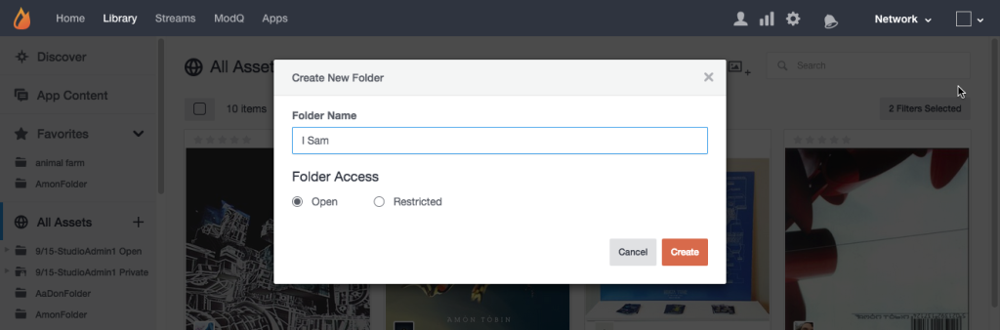

# Skapa resursmappar{#create-asset-folders}

Skapa mappar för att ordna resurser.

Om du skapar en ny mapp läggs den till i listan Alla resurser i alfabetisk ordning. Om du vill lägga till en undermapp markerar du först mappen som den ska placeras i och klickar sedan på ikonen **[!UICONTROL Create New Subfolder]** längst upp på sidan.

1. Klicka på **[!UICONTROL Create new folder]** i trädvyn, ange ett namn och klicka på **[!UICONTROL Create]** för att skapa mappen på den översta nivån i Alla resurser.
1. Markera en mapp och klicka sedan på ikonen **[!UICONTROL Create New Subfolder]** längst upp på sidan för att lägga till en undermapp.
1. Skapa en ny mapp när du lägger till innehåll i resursbiblioteket från dialogrutan **[!UICONTROL Add to folder > Select folder]**.
