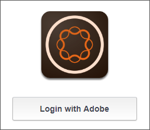
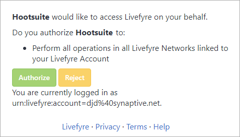
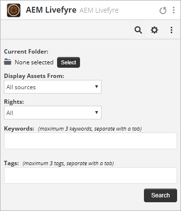
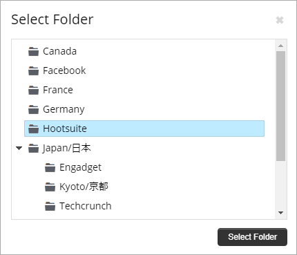
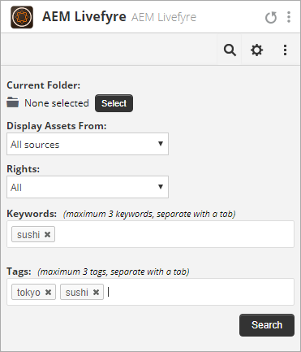
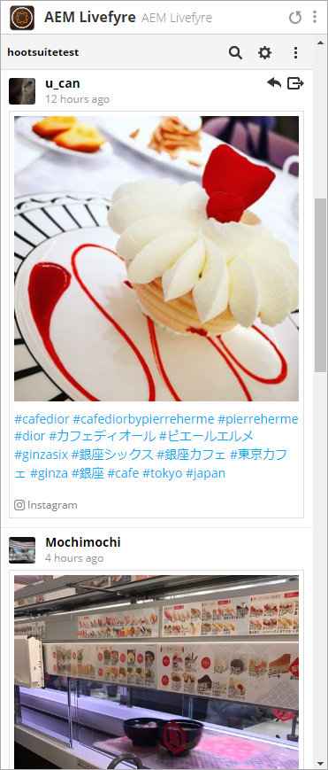
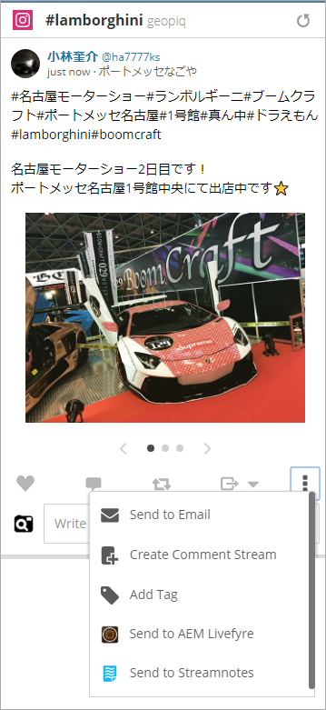
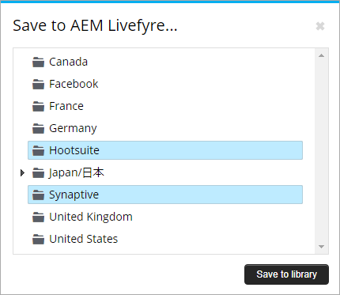
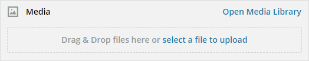
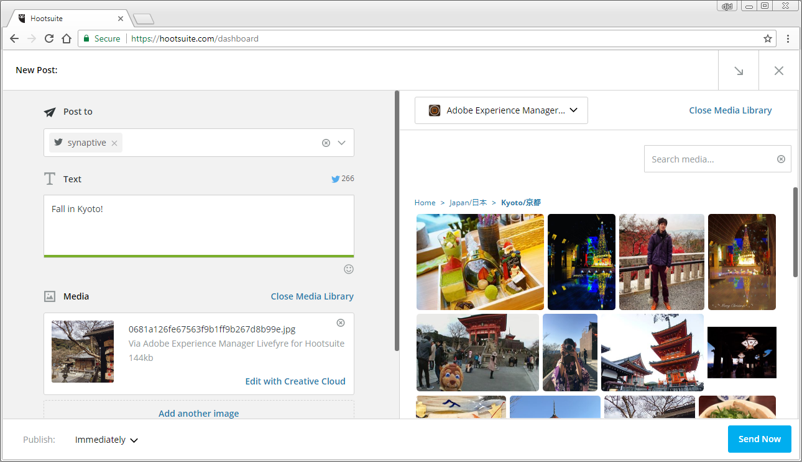

# Använd Adobe Experience Manager Livefyre med Hootsuite{#use-adobe-experience-manager-livefyre-with-hootsuite}

Lär dig hur du använder Experience Manager Livefyre med Hootsuite och kan strukturera, hantera och dela användargenererat innehåll direkt från Hootsuite-instrumentpanelen.

## Använd Adobe Experience Manager Livefyre med Hootsuite {#topic_FB6E613DBCF74F39ABD5045C501EA326}

Lär dig hur du använder Experience Manager Livefyre med Hootsuite och kan strukturera, hantera och dela användargenererat innehåll direkt från Hootsuite-instrumentpanelen.

## Komma igång {#task_22699BD901C24384AB2DC02D926D8F4A}

Aktivitetskontext

1. Installera Adobe Experience Manager Livefyre för Hootsuite från appkatalogen Hootsuite.

1. På din Hootsuite-panel klickar du på **Logga in med Adobe**.

   

1. Logga in på Experience Manager Livefyre med dina Livefyre-inloggningsuppgifter.
1. Klicka **Auktorisera** för att ge Hootsuite behörighet att komma åt dina bibliotek.

   

   När du har gett tillstånd återtas du till kontrollpanelen i Hootsuite där du kan söka efter resurser i dina Experience Manager Livefyre-bibliotek.

## Sök efter resurser {#task_0B011B0C539E400BB72A6DF69FBF66C0}

Aktivitetskontext

1. Klicka på sökikonen på menyraden för att söka efter resurser i dina Experience Manager Livefyre-bibliotek.

   

1. Klicka **Välj** och ett popup-fönster visas med alla dina bibliotek.
1. Klicka på biblioteksmappen och sedan på **Välj mapp** för att välja det bibliotek som ska visas i din Hootsuite-ström.

   

## Filtreringsalternativ {#concept_5D062A9CD61A4B2E90784E5AA31CB16D}

Du kan filtrera sökresultaten genom att använda avsnitten Visa resurser från, Rätt, Nyckelord och Taggar.

Filtreringsalternativen är:

| Avsnitt | Beskrivning |
|--- |--- |
| Visa resurser från | Välj det här alternativet om du vill visa resurser från alla källor eller från en enskild källa. Till exempel: Instagram, Twitter, Facebook osv. |
| Rättigheter | Välj det här alternativet om du bara vill visa resurser som har en specifik behörighetsinställning. |
| Nyckelord | Välj det här alternativet om du vill filtrera resultaten efter nyckelord eller taggar. Om du filtrerar efter nyckelord kommer du att söka efter textinnehållet i ett inlägg samt författarens visningsnamn och författarens användarnamn. |
| Taggar | Välj det här alternativet om du vill filtrera resultaten efter nyckelord eller taggar. Om du filtrerar efter nyckelord kommer du att söka efter textinnehållet i ett inlägg samt författarens visningsnamn och författarens användarnamn. |

När du har valt sökparametrar visas dina resurser i strömmen när du söker:

### Alternativ på menyn Direktuppspelning

Om du klickar på användarens namn eller ikon visas användaren i respektive nätverk. När du klickar på tiden visas den ursprungliga artikeln. När du för musen över objektet visas fler alternativ. Klicka på Dela 

kommer att lägga till den aktuella resursen i nätverksdispositionsrutan, så att du kan dela den med dina nätverk via Hootsuite.

>[!NOTE]
>
>Delningsknappen visas bara när du filtrerar efter resurser med behörighet.

Klicka på Tilldela   om du vill tilldela det aktuella objektet till någon av dina medlemmar i Hootsuite-teamet. Om ett objekt redan har tilldelats, åtgärdar du  visas. Klicka på det för att matcha det aktuella uppdraget.

### Andra programmenyer

Klicka på Inställningar   kan du koppla från det aktuella Experience Manager Livefyre-kontot och ansluta till ett annat.

Klicka på menyn   -ikonen visar länkar för det här dokumentet, support och Synaptive:s webbplats.

## Experience Manager Livefyre App Plugin {#task_33C8CEF4F5E44830B970BB3A7AAA2AA6}

Förutom att du kan visa dina resursbibliotek i en Hootsuite-ström kan du även spara objekt från Instagram, Twitter, Facebook och YouTube i dina Experience Manager Livefyre-bibliotek.

1. Klicka på menyikonen längst ned i varje objekt.

   

1. Välj **Skicka till AEM Livefyre**.
1. Välj ett eller flera bibliotek att spara resursen i.

   

1. Klicka **Spara i bibliotek** och objektet sparas i de bibliotek som du har valt.

## Experience Manager Livefyre Media Library Component {#task_9CA2D5D49F8E463F9EF475BC09C8ACC9}

Du kommer åt dina resurser via Mediekomponenter i Composer i Hootsuite.

1. Klicka på knappen **Öppna Media Library** i **Media** -avsnitt.

   

1. Välj Adobe Experience Manager Livefyre i listrutan så visas filerna.

   

1. Om du vill lägga till en resurs i det aktuella inlägget som du skriver klickar du på det. Om du vill söka efter en viss resurs anger du söktermerna i **Sök media** och resultatet visas.
