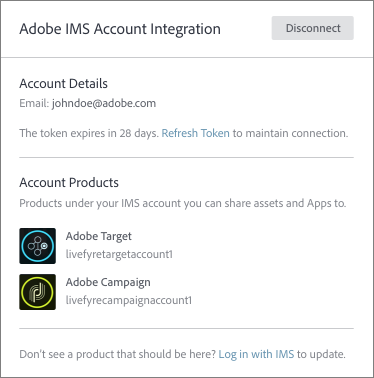
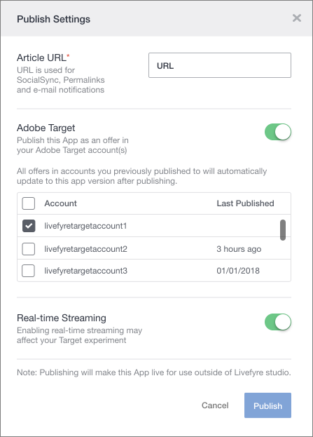

# Använd Adobe Experience Manager Livefyre med Adobe Target {#livefyre-target}

Tack vare Livefyre-integreringen med Adobe Target kan du dela Livefyre-appar direkt i ditt målbibliotek.

## Anslut en Livefyre-instans med målet {#connect-livefyre-target}

Koppla en Livefyre-instans till Adobe Target genom att länka ditt Adobe IMS-konto i användarinställningarna.

1. Klicka på fliken **[!UICONTROL Users]** i Livefyre Studio.

1. Välj det användarkonto som du vill ansluta till mål via IMS-kontointegrering.

1. Klicka på **[!UICONTROL Connect]**.

1. Ange dina IMS-autentiseringsuppgifter.

De produktinstanser som ditt Adobe IMS-konto har tillgång till för visning i fönstret Adobe IMS-integrering.

Din Livefyre-instans är nu ansluten till Adobe Target.

## Dela en Livefyre-app med Adobe Target {#share-livefyre-target}

Dela en app som skapats i Livefyre Studio direkt med Adobe Target.

1. Klicka på fliken **[!UICONTROL Apps]** i Livefyre Studio.

1. Välj den app du vill dela till Adobe Target.

1. Klicka på **[!UICONTROL Publish]**.

1. Klicka på Adobe Target i Publiceringsinställningar.

En lista över målinstanser visas.

1. Välj den Target-instans i vilken du vill dela appen.

1. Klicka på  **[!UICONTROL Publish]**.

Livefyre-appen är nu tillgänglig för användning i ditt måloffertbibliotek. Mer information om att publicera appar finns i [Publicera innehåll](/help/using/c-library/t-publish-content.md) och [erbjudanden](https://docs.adobe.com/content/help/en/target/using/experiences/offers/manage-content.html) i Target-dokumentationen.