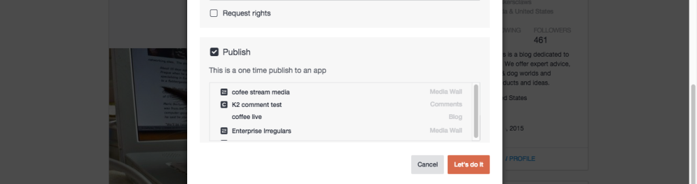

# Publicera innehåll{#publish-content}

Publicera innehåll direkt i en app.

Innehåll som publiceras direkt till en app sparas inte i ditt resursbibliotek.

1. **[!UICONTROL View Details]** för en tillgång.
1. Markera **[!UICONTROL Publish]** kryssrutan i **[!UICONTROL Advanced Options]** dialogrutan.
1. Välj appen som objektet ska publiceras till.
1. Klicka på **[!UICONTROL Let’s do it]**.
