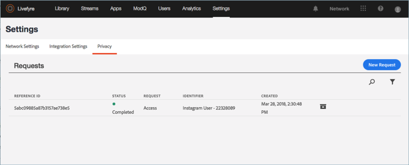

# Skapa en sekretessförfrågan{#create-a-privacy-request}

Skapa en sekretessförfrågan i Livefyre.

Ta bort alla data för en användare, generera en rapport över alla data för en användare och gör ändringar av anmälan eller avanmälan med den här processen.

Så här söker du efter och söker efter en användare och skapar en rapport om deras innehåll:

1. Gå till **[!UICONTROL Settings > Privacy]** och klicka sedan på **[!UICONTROL Create Request]**.

   

1. Fyll i informationen i **[!UICONTROL Submit Request]** fönstret:

   * **[!UICONTROL Reference Id]**. Ange en identifierare som ska användas för framtida referens. Du kan till exempel lägga till text, ett biljettnummer, en URL, en e-postadress eller en annan sträng på upp till 255 tecken
   * **[!UICONTROL Type]**

      * **Åtkomst**. Samlar in alla tillgängliga data som är kopplade till kontot. Känsliga detaljer, till exempel lösenord eller sociala referenser, döljs eller utelämnas.

      * **Ta bort**. Ändrar eller döljer alla data som är associerade med kontot. **Om du väljer det här alternativet och klickar på Skicka kan du inte ångra eller avbryta den här åtgärden,*och du kan inte heller återställa borttagna data.***Om kontot tillhör en Livefyre Studio-användare bevaras vissa data för att upprätthålla integriteten i dina affärsposter.

         >[!IMPORTANT]
         >
         >Om du tar bort data för ett konto tas data som är kopplade till kontot bort eller förstörs permanent. Du kan inte ångra den här åtgärden och inte heller återställa data efter att du har tagit bort den.

      * **Avanmäl dig**. Förhindrar Livefyre från att passivt samla in data eller innehåll från ett socialt konto via Streams eller Social Search. Avanmäl dig och avanmäl dig inte för registrerade användare
      * **Anmäl dig**. Återaktiverar Livefyre för att passivt samla in data eller innehåll från ett socialt konto som tidigare valt ut via Streams eller Social Search. Avanmäl dig och avanmäl dig inte för registrerade användare
      

   * **[!UICONTROL Identifier Type]** och **[!UICONTROL Identifier]**

      * **[!UICONTROL User Account]**

         * Identifierar ett konto för en registrerad användare med det användar-ID som genereras av ditt användarhanteringssystem eller Livefyres Studio-användaridentifierare. Du kan också hitta användar-ID:t i Användarinformation för användaren i **Livefyre** **användarinställningar** eller i informationen om innehållet i **resursbiblioteket** eller **programinnehållet**

         * Tillåtna värden: Alfanumerisk sträng på upp till 255 tecken. En e-postadress är inte en giltig inmatning
      * **[!UICONTROL Facebook User]**

         * Identifierar ett konto med ett numeriskt ID från Facebook. Den som gjorde begäran bör ange detta. Här finns instruktioner om hur du hittar det numeriska Facebook-ID:t [här](https://www.facebook.com/help/1397933243846983?helpref=faq_content)
         * Tillåtna värden: 6-16 numeriska tecken
      * **[!UICONTROL Instagram User]**

         * Identifierar kontot med ett numeriskt ID som tillhandahålls av Instagram. Den som gjorde begäran bör ange detta. Du hittar instruktioner om hur du hittar det numeriska Instagram-ID:t på ett Instagram-konto genom att söka online
         * Tillåtna värden: 5-16 numeriska tecken
      * **[!UICONTROL Twitter User]**

         * Identifierar ett konto med ett numeriskt ID från Twitter. Den person som begär ändringen av sekretessen bör tillhandahålla detta. Du hittar instruktioner om hur du hittar det numeriska Twitter-ID:t för ett Twitter-konto genom att söka online
         * Tillåtna värden: 5-16 numeriska tecken
      * **[!UICONTROL YouTube User]**

         * Identifierar ett konto med ett numeriskt ID från YouTube. Den person som begär ändringen av sekretessen bör tillhandahålla detta. Här finns instruktioner om hur du hittar det numeriska YouTube-ID:t på ett YouTube-konto [här](https://support.google.com/youtube/answer/3250431?hl=en)
         * Tillåtna värden: 5-16 numeriska tecken
      * **[!UICONTROL Generic Author]**

         * Identifierar ett konto med ett ID för Livefyre Author ID (JID). Använd det här alternativet för innehåll som har hämtats via RSS, Tumblr eller URL:er. Om du vill hitta det här ID:t söker du efter innehåll som har tilldelats författaren i **programinnehållet** eller **resursbiblioteket** och markerar sedan ett objekt. ID:t är tillgängligt i **appinnehåll** under **Info** eller i **resursbiblioteket** under **Författare** i avsnittet **Detaljer**

         * Tillåtna värden: Alfanumerisk sträng på upp till 255 tecken
         

1. Klicka på **[!UICONTROL Finish]**.

   

1. (Endast för borttagningsbegäranden) Bekräfta att du vill ta bort all information för användaren.

   >[!IMPORTANT]
   >
   >Om du tar bort data för ett konto tas data som är kopplade till kontot bort eller förstörs permanent. Du kan inte ångra den här åtgärden och inte heller återställa data efter att du har tagit bort den.

