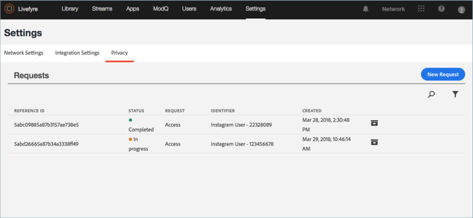

# Visa en sekretessrapport{#view-a-privacy-report}

Se en sekretessrapport i Livefyre för att se vilken information som registreras i Livefyre för en användare.

1. Gå till **[!UICONTROL Settings > Privacy]**.
1. Klicka på en sekretessrapport i listan för att visa den.

