# Lokalisera strängar{#localize-strings}

Anpassa strängarna för Livefyre-apparna.

Textsträngarna för de flesta HTML-element i alla Livefyre-appar kan anpassas. Detta ger flexibilitet att ändra texten i återgivna HTML-element, t.ex. knappen &quot;Skicka som&quot;, texten &quot;Antal kommentarer&quot; eller knappen &quot;Logga in&quot;, till en giltig UTF-8-sträng. Använd den här funktionen om du vill göra dataströmmen mer personlig eller om du vill lokalisera språket i appen för din användarbas.

* Kommentarer, chatt och Live-blogg

   * [Implementering](#c-localize-strings/section_im4_224_xz)
   * [Kontoåtkomst](#c-localize-strings/section_cm3_d24_xz)
   * [Direktuppspelningsinformation](#c-localize-strings/section_wx1_c24_xz)
   * [Direktsortering](#c-localize-strings/section_ih2_124_xz)
   * [Innehållsinformation](#c-localize-strings/section_llv_yd4_xz)
   * [Innehåll](#c-localize-strings/section_gmw_vd4_xz)
   * [Textredigerare](#c-localize-strings/section_ky5_td4_xz)
   * [Svarsalternativ](#c-localize-strings/section_zvt_qd4_xz)
   * [Kommentarsmeddelande](#c-localize-strings/section_qqt_pd4_xz)
   * [Felmeddelanden](#c-localize-strings/section_omz_jxn_xz)

* [Tid- och datumformat](#c-localize-strings/section_yz4_g5n_xz)
* [Media Wall](#c-localize-strings/section_vwt_d5n_xz)
* [Karta](#c-localize-strings/section_fxv_c5n_xz)
* [Mosaik](#c-localize-strings/section_e2s_b5n_xz)
* [Carousel](#c-localize-strings/section_l2z_hkn_xz)
* [Funktionskort](#c-localize-strings/section_mw2_hkn_xz)
* [Omröstning](#c-localize-strings/section_pdg_fwh_xz)
* [Livefyre-identitet](#c-localize-strings/section_zc3_xvh_xz)
* Mer:
   * [Granska textsträngar](/help/using/c-settings-other/c-translation-sets/c-review-text-strings.md#c_review_text_strings)
   * [Sidenotes](/help/using/c-settings-other/c-translation-sets/c-sidenotes-text-strings.md#c_sidenotes_text_strings)

## Implementering {#section_im4_224_xz}

Om du vill implementera den här funktionen skickar du en 1-1-objektmappning av strängarna som du vill åsidosätta till JavaScript-konfigurationsobjektet. Om du inte anger något fält används standardtexten.

Exempel:

```
var customStrings = {     
   postAsButton: "New Post As Text",     
   postEditButton: "New Post Edit Text"  
};   
   convConfig["strings"] = customStrings; fyre.conv.load(     
   networkConfig,     
   [convConfig],     
   function(){}  
);
```

På den här sidan visas alla textsträngar som kan anpassas för huvudapparna för Livefyre.

## Kontoåtkomst {#section_cm3_d24_xz}

Strängar som är tillgängliga för autentiseringsprocessen och från de autentiserade användarmenyerna.

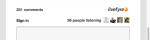

| Element | Nyckel | Standardtext |
|---|---|---|
|  | displayName | %s |
|  | editProfile | Redigera profil |
|  | notificationSettings | Meddelandeinställningar |
|  | siteAdmin | Admin Console (länkar till Studio) |
|  | signOut | Logga ut |

## Direktuppspelningsinformation {#section_wx1_c24_xz}

Strängar som är tillgängliga för information och visning av innehållsströmmar. Visar antalet personer som lyssnar, antalet inlägg i appen och tillåter användare att logga in eller komma åt sin kontoinformation.

| Nyckel | Standardtext | Strömdata |
|---|---|---|
|  | commentCountLabelZero | %s kommentar |
|  | commentCountLabel | %s kommentar |
|  | commentCountLabelPlural | %s kommentarer |
|  | listenerCount | personavlyssning |
|  | listenerCountPlural | personer som lyssnar |
|  | liveblogPostCountLabelZero | post |
|  | liveblogPostCountLabel | post |
|  | liveblogPostCountLabelPlural | inlägg |
| Kopplingsalternativ | threadBreakoutButton | Visa hela tråden |
|  | toggleCollapse | Växla komprimering |
| Kommentarer med hög hastighet/köade | uppdatera | Uppdatera |
|  | newComment | Ny kommentar |
|  | newComments | Nya kommentarer |
|  | newReply | nytt svar |
|  | newReplies | nya svar |

## Direktsortering {#section_ih2_124_xz}

Tillåter användning för att sortera returnerat innehåll efter ålder eller popularitet.

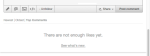

| Nyckel | Standardtext | Rubrikalternativ |
|---|---|---|
|  | sortNewest | Nyaste |
|  | sortOldest | Äldsta |
|  | sortTopComments | Vanliga kommentarer |
|  | sortHotThreads | Aktiva trådar |
|  | sortSeparator |  |  |
|  | streamSorting | Läser in |
|  | topCommentsContentNotFoundMsg | Det finns inte tillräckligt med gilla-markeringar än. |
|  | hotThreadsContentNotFoundMsg | Det finns inte tillräckligt många trådar än. |
|  | streamRefreshMsg | Se vad som är nytt. |
| Alternativ för sidfot | archiveHeaderTitle | Från arkivet |
|  | archiveShowMore | Visa fler |
|  | showMore | Visa fler kommentarer |
|  | showMoreLiveblog | Visa fler inlägg |

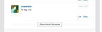

## Innehållsinformation {#section_llv_yd4_xz}

Visar inläggsinformation: användarnamn, eventuella användartaggar och posttid.

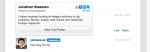  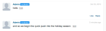

| Nyckel | Standardtext | Upphovsman |
|---|---|---|
|  | moderator | moderator |
|  | hovercardViewProfile | Visa fullständig profil |
| Bokför info | timeJustNow | just nu |
|  | timeMinutesAgo | minut sedan |
|  | timeMinutesAgoPlural | minuter sedan |
|  | timeHoursAgo | timme sedan |
|  | timeHoursAgoPlural | timmar sedan |
|  | timeDaysAgo | dag sedan |
|  | timeDaysAgoPlural | dagar sedan |
|  | likePlural | Liknar |
|  | likeSingular | Gilla |
|  | moderatorEditTimestamp | Redigerad av en moderator |
|  | commentTombstone | Den här kommentaren har tagits bort |
|  | permanentLinkNotFoundMsg | Den här kommentaren visas inte längre. |
|  | quickProfileTooltip | Snabb profil |

## Innehåll {#section_gmw_vd4_xz}

Om det här alternativet är aktiverat visas aktuellt innehåll högst upp i strömmen.

|  | Nyckel | Standardtext |
|---|---|---|
| Etiketter |  |  |
| 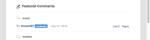 | featuredCommentsTag | Aktuellt |
|  | featuredCommentsTitlePlural | Kommentarer |

## Textredigerare {#section_ky5_td4_xz}

Som standard är den tillgänglig längst upp på sidan för alla användare.

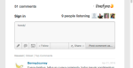

|  | Nyckel | Standardtext |
|---|---|---| 
| Redigeringsknappar | följ | + Följ |
|  | unfollow | - Unfollow |
|  | liveblogFölj | Följ Live-bloggen |
|  | liveblogUnfollow | Ta bort Live-blogg |
|  | postButton(Tillgängligt för inloggade användare.) | Bokför kommentar |
|  | postAsButton(Tillgängligt för oautentiserade användare.) | Bokför kommentar som... |
|  | postEditButton | Redigera kommentar |
|  | postEditAsButton | Redigera kommentar som... |
|  | postEditCancelButton | Avbryt |
|  | editorDisabled | Den här konversationen är för närvarande stängd för nya kommentarer. |
| Chattalternativ | livechatPostButtonLabel | Bokför |
|  | livechatPostEditButton | Redigera |
|  | livechatWindowsInstruction | Tryck på Ctrl+Retur för att skicka |
|  | livechatOtherInstruction | Tryck på Kommando+Retur för att skicka |

## Svarsalternativ {#section_zvt_qd4_xz}

Om inget annat anges är det tillgängligt för alla inloggade användare. För musen över en innehållspanel för att komma åt den.

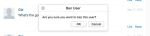

| Nyckel | Standardtext |  |
|---|---|---|
| Alternativ för användarsvar | Tillgängligt för slutanvändare. |  |
| flagButton | Flagga |
|  | flagCommentTooltip | Flagga |
|  | editButton (endast tillgängligt för författare och moderatorer, om aktiverat.) | Redigera |
|  | deleteButton(Endast tillgängligt för författare och moderatorer, om aktiverat.) | Ta bort |
|  | deleteCommentTooltip | Ta bort |
|  | shareButton | Dela |
|  | shareCommentTooltip | Dela |
|  | likeButton | Gilla |
|  | leftButton | Ogilla |
|  | replyButton | Svara |
|  | replyButtonSingular(Available for Chat and Live Blog.) | Svara |
|  | replyButtonPlural(tillgänglig för Chat och Live Blog.) | Svar |

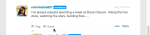

| Nyckel | Standardtext |  |
|---|---|---|
| Flag Modal | flagTitle | Flagga %s kommentar |
|  | flagSubtitle | Flagga som |
|  | flagDefaultSelectOption | Välj |
|  | flagSpam | Spam |
|  | flagSpamButton | Spam |
|  | flagSpamCommentTooltip | Spam |
|  | flagOffensive | Stötande |
|  | flagOffensiveButton | Stötande |
|  | flagOffensiveCommentTooltip | Stötande |
|  | flagDisagree | Avböja |
|  | flagDisagreeButton | Avböja |
|  | flagDisagreeCommentTooltip | Avböja |
|  | flagOffTopic | Av ämne |
|  | flagOfftopicButton | Av ämne |
|  | flagOfftopicCommentTooltip | Av ämne |
|  | flagEmail | E-post |
|  | flagEmailPlaceholder | you@example.com |
|  | flagNotes | Anteckningar |
|  | flagNotesPlaceholder | Börja skriva här.. |
|  | flagConfirmButton | OK |
|  | flagCancelButton | Avbryt |
|  | flagConfirmationMessage | Flagga %s kommentar som %s? |
|  | flagSuccessMsg | Kommentaren har flaggats. |

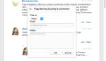

| Nyckel | Standardtext |  |
|---|---|---|
| Dela Modal | shareTitle | Dela kommentar |
|  | sharePlaceholderText | Vad tycker du? |
|  | shareLabel | Dela på: |
|  | shareTextTwitter | blank |
|  | shareTextFacebook | blank |
|  | shareTextLinkedin | blank |
|  | shareButtonText | Dela |
|  | sharePermalink | Permalink |
|  | loadingPermalink | Läser in kort URL.. |
|  | shareText | Jag har precis skrivit en kommentar. Kolla in den! |

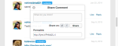

| Nyckel | Standardtext |  |
|---|---|---|
| Svarsmodul | postSvaraSomKnapp | Bokför kommentar som... |
|  | postReplyButton(Tillgängligt för inloggade användare.) | Bokför kommentar |
|  | backToHotThreads | Tillbaka till Hot Threads |

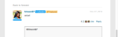

| Nyckel | Standardtext |  |
|---|---|---|
| Twitter @mention modal | mentionTitle | Dela - omnämnande |
|  | mentionSubtitleTwitter | Dela tweet till: |
|  | mentionDefaultText | Jag nämnde dig i en Livefyre-kommentar! |
|  | mentionConfirmButton | OK |
|  | mentionCancelButton | Avbryt |
|  | mentionErrorGeneral | Oj då! Något gick fel. Livefyre har fått en varning. |
|  | mentionErrorNoneSelected | Du måste ha minst ett omnämnande aktiverat. |
|  | mentionMenuTitle | För att se och nämna dina vänner |
|  | mentionTwitterConnect | Anslut till Twitter |
|  | mentionTwitterFetching | Hämtar vänner... |
|  | mentionSuccessMsg | Meningarna har skickats |

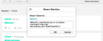

| Nyckel | Standardtext |  |
|---|---|---|
| Redigera modul | Tillgängligt för Studio Admins, User Managers och Moderators |  |
| @(@mention.) | &lt;/>(Öppnar det anpassade html-fönstret.) |  |
|  | customHtmlDialogTitle(Visas som rubrik för modal.) | Lägg till anpassad HTML |

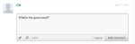

| Nyckel | Standardtext |  |
|---|---|---|
| Alternativ för moderatorsvar | Finns för Studio Admins, User Managers och Moderators. |  |
| pendingComment | väntar |
|  | banUserButton | Bannlyanvändare |
|  | banUserTooltip | Förhindra användare |
|  | bozoButton | Bozo |
|  | bozoCommentTooltip | Bozo |
|  | featureButton | Funktion |
|  | featureCommentTooltip | Funktion |
|  | unfeatureButton | Avaktivera |
|  | featuredCommentTooltip | Avaktivera |

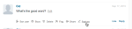

| Nyckel | Standardtext |  |
|---|---|---|
| Förhindra användare modal | Finns för Studio Admins, User Managers och Moderators. |  |
| banTitle | Förhindra användare |  |
|  | banConfirmation | Vill du förbjuda den här användaren? |
|  | banConfirmButton | OK |
|  | banCancelButton | Avbryt |

## Kommentarsmeddelande {#section_qqt_pd4_xz}

Om det här alternativet är aktiverat finns längst ned på sidan för alla appar för Livefyre-konversationer.

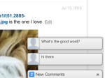

|  | Nyckel | Standardtext |
|---|---|---|
| Meddelandeetiketter | commentNotifier | Ny kommentar |
|  | commentNotifierPlural | Nya kommentarer |
|  | liveblogNotifier | Nytt inlägg |
|  | liveblogNotifierPlural | Nya inlägg |

## Felmeddelanden {#section_omz_jxn_xz}

Strängar som är tillgängliga för anpassningsbara felmeddelanden.

| Nyckel | Standardtext |
|---|---|
| errorAuthError | Du har inte behörighet att publicera en kommentar i den här konversationen |
| errorCommentsNotAllowed | Kommentarer tillåts inte för den här konversationen |
| errorDefault | Ett fel har inträffat. Försök igen. |
| errorDuplicate | Även om du gillar din kommentar får du inte publicera den två gånger. |
| errorEditDuplicate | Du måste ändra innehållet i kommentaren när du redigerar den. |
| errorEditNotAllowed | Du har inte behörighet att redigera kommentarer i den här konversationen. |
| errorEditTimeExceeded | Din kommentarredigeringsperiod har gått ut. |
| errorEmpty | Det verkar som att du försöker publicera en tom kommentar. |
| errorExpired | Din session har gått ut. Läs in sidan igen. |
| errorFlagNotSelected | Välj en flaggtyp. |
| errorGuestLiked | Det är bara de med konton som kan gilla innehåll. |
| errorInsufficientPermissions | Otillräckliga behörigheter |
| errorInvalidChar | Det verkar som att du försöker posta ett ogiltigt tecken. |
| errorLikeOwnComment | Du kan inte gilla din egen kommentar |
| errorMalformed | Det verkar som att du försöker publicera innehåll med felaktigt format. |
| errorMaxChars | Din kommentar är för lång. Redigera och försök igen. |
| errorMediaNotAvailable | Mediet är inte längre synligt. |
| errorShowMore | Det uppstod ett fel när fler kommentarer skulle läsas in. |
| MultipleMediaNotAllowedError | Dina behörigheter ger dig bara en mediebilaga i taget. |

## Tid- och datumformat {#section_yz4_g5n_xz}

Översätt och anpassa hur datum visas på innehållskort i visualiseringsappar.

| Nyckel | Standardtext |
|---|---|
| hoursAgo | {number}h |
| hoursAgoSingular | {number}h |
| justNow | 1s |
| minutesAgo | {number}m |
| minutesAgoSingular | {number}m |
| monthDayFormat | {day} {monthAbslr} |
| monthDayYearFormat | {day} {monthAbslr} {year} |
| monthNames | Januari, februari, mars, april, maj, juni, juli, augusti, september, oktober, november, december |
| monthNamesAbrött | jan, feb, mar, apr, maj, jun, jul, aug, sep, okt, nov, dec |
| secondsAgo | {number}s |
| secondsAgoSingular | {number}s |

## Media Wall {#section_vwt_d5n_xz}

Strängar som är tillgängliga för Media Wall App.

| Nyckel | Standardtext |
|---|---|
| featuredText | Aktuellt |
| shareButtonText | Dela |

| Nyckel | Standardtext |
|---|---|
| postButtonText | Vad tänker du på? |
| postModalTitle | Lägg upp din kommentar |
| postModalButton | Lägg upp din kommentar |
| postModalPlaceholder | Vad vill du säga? |
| showMoreButtonText | Läs mer |
| shareButtonText | Dela |

## Karta {#section_fxv_c5n_xz}

Strängar tillgängliga för kartor.

| Nyckel | Standardtext |
|---|---|
| featuredText | Aktuellt |
| shareButtonText | Dela |

## Mosaik {#section_e2s_b5n_xz}

Strängar tillgängliga för Mosaik.

| Nyckel | Standardtext |
|---|---|
| featuredText | Aktuellt |
| shareButtonText | Dela |

## Carousel {#section_l2z_hkn_xz}

Strängar tillgängliga för Carousel.

| Nyckel | Standardtext |
|---|---|
| featuredText | Aktuellt |
| shareButtonText | Dela |

## Funktionskort {#section_mw2_hkn_xz}

Strängar som är tillgängliga för funktionskortet.

| Nyckel | Standardtext |
|---|---|
| featuredText | Aktuellt |
| shareButtonText | Dela |

## Överför app {#section_grc_gkn_xz}

Strängar som är tillgängliga för Upload App.

| Nyckel | Standardtext |
|---|---|
| postButtonText | Vad tänker du på? |
| postModalTitle | Lägg upp din kommentar |
| postModalButton | Lägg upp din kommentar |
| postModalTitlePlaceholder | Ange en titel |
| postModalPlaceholder | Vad vill du säga? |
| postModalConfirationTitle | Tack för ditt inlägg! |
| postModalConfirmationMessage | Ditt inlägg håller på att granskas. |
| postModalConfirmationButton | Klar |
| title |  |
| message |  |
| editorErrorAttachmentsRequired | En bifogad fil krävs |
| editorErrorBody | Lägg till ett meddelande |
| editorErrorDuplicate | Så mycket du gillar din anteckning kan du inte posta den två gånger |
| editorErrorGeneric | Ett fel uppstod |
| editorErrorTitleRequired | En titel krävs |

## Omröstning {#section_pdg_fwh_xz}

Strängar tillgängliga för omröstningar.

| Nyckel | Standardtext |
|---|---|
| totalVotesLabel | %s totala röster |
| shareStringText | Jag röstade just på %s vad är din röst? |
| pollClosedLabel | Avsökningen är för närvarande stängd |

## Livefyre-identitet {#section_zc3_xvh_xz}

Strängar tillgängliga för Livefyre Identity.

| Nyckel | Standardtext |
|--- |--- |
| automaticallyFöljKonversationer | Följ konversationer jag går med i automatiskt |
| bak | Bakåt |
| bio | Bio |
| skapa | Skapa |
| createANewAccount | Skapa nytt konto |
| createNewAccountWithEmail | Skapa ett nytt konto med e-post |
| changeAvatar | Ändra avatar |
| chooseFile | Välj fil |
| completeAccount | Fullständigt konto |
| emailWhenNågonReplies | Skicka e-post när någon svarar mig |
| emailCommentsIFollow | E-postkommentarer i konversationer som jag följer |
| emailSenttoResetPassword | E-post skickad! Kontrollera din inkorg om det finns en länk för att återställa ditt lösenord |
| emailVerificationSent | E-postverifiering har skickats |
| firstName | Förnamn |
| ignorePassword | Har du glömt lösenordet? |
| ignoreYourPassword | Har du glömt lösenordet? |
| ignoreYourPasswordInstructions | Ange ditt användarnamn eller din e-postadress nedan så skickar vi en länk till dig för att ändra ditt lösenord. |
| formInputCloseButtonText | Stäng |
| formInputCancelButtonText | Avbryt |
| formInputSaveButtonText | Spara |
| hasNotLeftAnyComments | har inte lämnat några kommentarer |
| locationIsFrom | är från |
| labelAvatar | Avatar |
| labelComments | Kommentarer |
| labelConfirmNewPassword | Bekräfta nytt lösenord |
| labelConfirmPassword | Bekräfta lösenord |
| labelEmail | E-postadress |
| labelLikes | Liknar |
| labelLoading | Läser in |
| labelNewPassword | Nytt lösenord |
| labelNotification | Meddelanden |
| labelPassword | Lösenord |
| labelProfile | Profil |
| labelUsername | Användarnamn |
| labelUsernameOrEmail | Användarnamn eller e-postadress |
| lastName | Efternamn |
| livefyreAccount | Livefyre-konto |
| plats | Plats |
| loadingProfile | Läser in profil |
| newPassword | Nytt lösenord |
| oldPassword | Gammalt lösenord |
| på | på |
| eller | eller |
| passwordLinkExpired | Länken som du klickade på för att återställa lösenordet har upphört att gälla. Återställ lösenordet igen så skickar vi en ny länk till dig. |
| gleckEmailToComplete | Kontrollera din e-postadress för att slutföra registreringen. |
| bokförd | Bokfört |
| poweredBy | med |
| profileNotificationOmedelbar | omedelbar |
| profileNotificationHourly | varje timme |
| profileNotificationNever | aldrig |
| recentComments | Senaste kommentarer |
| återställ | Återställ |
| resetPassword | Återställ lösenord |
| signIn | Logga in |
| signInWith | Logga in med |
| signInWithEmail | Logga in med e-post |
| signUp | Registrera dig |
| socialAccount | Socialt konto |
| successPasswordChanged | Klart! Lösenordet har ändrats och du är nu inloggad |
| termsAndConditions | Villkor |
| termsAndConditionsIntro | Genom att registrera dig godkänner du |
| termsOfUse | Användarvillkor |
| termsOfUseIntro | Genom att logga in godkänner du |
| thisUser | Den här användaren |
| verifyPassword | Bekräfta lösenord |
| fileSizeLimit | 2 MB max |
| accountNot found | Kontot hittades inte |
| avatarImageExceedSize | Din avatarbild har överskridit gränsen på 2 MB |
| fieldDisrequired | Fältet accepterar endast ett heltal |
| fältdonlyacceptsavalidemail | Fältet accepterar endast en giltig e-postadress |
| fältaccepterandemetoder | Endast fält accepterar bokstäver |
| filesizemustbelessthanMB | Filstorleken måste vara mindre än {#}MB |
| invalidusernamorpassword | Ogiltigt användarnamn eller lösenord |
| minimumlengthOf-tecken | Minsta längd på {#} tecken |
| maxLengthOf-tecken | Maximal längd för {#} tecken |
| rotwasanerror | Ett fel uppstod |
| thisFieldDisrequired | Det här fältet är obligatoriskt. |
| validfileextensions | Giltiga filtillägg |
| valuemustmatch | Värdet måste matcha |
| passwordLength | vara 6 till 32 tecken långt. |
| passwordCharacters | innehåller både gemener och versaler. |
| passwordSymbols | innehåller minst en siffra och en symbol. |
| passwordUsername | innehåller inte ditt användarnamn. |
| passwordPopoverTitle | Lösenordet måste: |
| passwordErrorContainsFirstName | Lösenordet du angav innehåller antingen ditt användarnamn, förnamn eller efternamn. Av säkerhetsskäl måste du ange ett lösenord som inte innehåller ditt användarnamn, förnamn eller efternamn. Kom ihåg att ditt lösenord måste innehålla: 6 till 32 tecken Ett versalt A-tecken med gemener A-symbol |
| passwordErrorContainsLastName | Lösenordet du angav innehåller antingen ditt användarnamn, förnamn eller efternamn. Av säkerhetsskäl måste du ange ett lösenord som inte innehåller ditt användarnamn, förnamn eller efternamn. Kom ihåg att ditt lösenord måste innehålla: 6 till 32 tecken Ett versalt A-tecken med gemener A-symbol |
| passwordErrorContainsUserName | Lösenordet du angav innehåller antingen ditt användarnamn, förnamn eller efternamn. Av säkerhetsskäl måste du ange ett lösenord som inte innehåller ditt användarnamn, förnamn eller efternamn. Kom ihåg att ditt lösenord måste innehålla: 6 till 32 tecken Ett versalt A-tecken med gemener A-symbol |
| passwordErrorTooShort | Minst 6 tecken för lösenord |
| passwordErrorTooLong | Lösenordet får innehålla högst 32 tecken |
| passwordErrorMissingUppercase | Lösenordet måste innehålla minst ett versaltecken |
| passwordErrorMissingLowercase | Lösenordet måste innehålla minst ett tecken med gemener |
| passwordErrorMissingSymbol | Lösenordet måste innehålla minst en symbol i uppsättningen `!@#$%^&*()?.,<>\’;:”[]{}|` |


