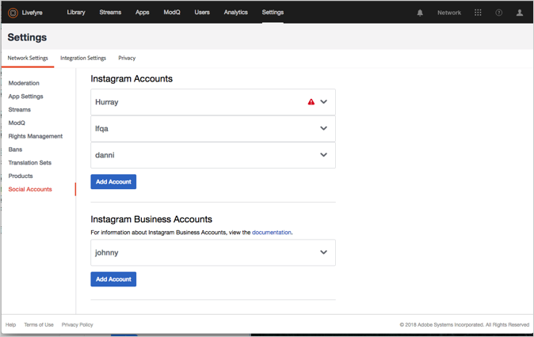
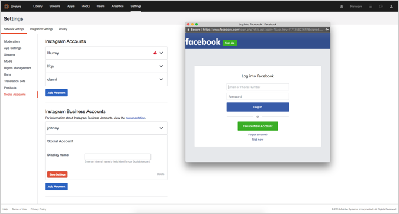

# Lägg till ett socialt konto{#add-a-social-account}

Konfigurera ett socialt konto för att begära rättigheter eller söka efter UGC i strömmar eller sociala sökningar.

Livefyre använder sociala Twitter- och Instagram-konton för att göra det möjligt att utföra en social sökning (i biblioteket) eller att använda strömmar.

Du måste konfigurera ett konto på Twitter för att kunna använda den sociala sökningen på Twitter i biblioteket.

Instagram har olika regler för sociala konton, beroende på hur du använder Adobe Livefyre. Mer information om vilken typ av konton för sociala medier du kan använda med Livefyre finns i [Om Instagram-konton](/help/using/c-users-creating-accounts-with-studio-access/t-configure-social-accout-instagram/c-about-instagram-accounts.md#c_about_instagram_accounts).

Så här konfigurerar du ett socialt konto:

1. Navigera till **[!UICONTROL Settings >]** **[!UICONTROL Network Settings.]**
1. Navigera till **[!UICONTROL Social Accounts]** avsnittet under **[!UICONTROL Network Settings]**.
1. Klicka **[!UICONTROL Add Account]** under den typ av socialt konto som du lägger till. En dialogruta öppnas där du kan godkänna kontot för Livefyre.

   

   >[!NOTE]
   >
   >När du konfigurerar ett Instagram-företagskonto visas inloggningsskärmen för Facebook. Fortsätt logga in som vanligt.   >

1. Klicka **[!UICONTROL Authorize App]** för att fortsätta.
1. Lägg till en **[!UICONTROL Display Name]** för kontot och klicka sedan på **[!UICONTROL Save Settings.]**. Klicka på **[!UICONTROL Social Account]** i kontoinformationsrutans huvud för att komprimera kontot.
