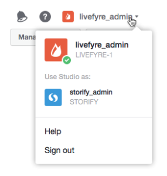

# Användare som byter nätverk{#users-switching-networks}

Du kan hantera flera nätverk från ett enda Studio-konto.

>[!NOTE]
>
>Detta är inte vanligt.

I listrutan visas alla användarnamn som är kopplade till det Studio-konto som du är inloggad på och de nätverk som de är kopplade till. **[!UICONTROL Account]** Använd den här pulldown-menyn för att välja det nätverk som du vill hantera.

>[!NOTE]
>
>De flesta användare har endast behörighet för ett nätverk, men vissa Studio-användare kan äga eller moderera flera platser. Med Studio-kontot kan de logga in med ett enda användarnamn och lösenord och sedan växla mellan olika åtkomstnivåer.

