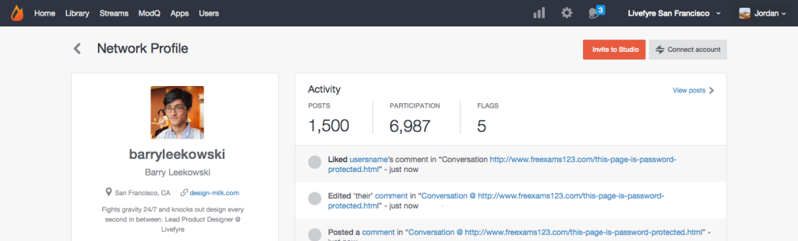

# Länka användarkonton{#link-user-accounts}

Länka ditt Studio-konto till ditt Livefyre-konto för att moderera eller hantera alla dina Livefyre-sajter eller nätverk från en och samma plats.

>[!NOTE]
>
>Om du vill interagera med en Livefyre-app (t.ex. lämna en kommentar, lägga till en Sidenote eller dela innehåll) måste du logga in med användarnamnet och lösenordet för ditt Livefyre-konto och inte med ditt användarnamn och lösenord för ditt Studio-konto.

Så här länkar du konton:

1. Logga in i Studio när du har skapat en Livefyre-användarprofil i nätverket.
1. Gå till **[!UICONTROL Users]**, hitta din användarprofil och dubbelklicka för att visa information.
1. Klicka på **[!UICONTROL Connect account]**.
1. I det fönster som öppnas väljer du det användarkonto som du vill länka till det här kontot.
1. Bekräfta **[!UICONTROL Link Profile]**-informationen och klicka på **[!UICONTROL Link]**. 
