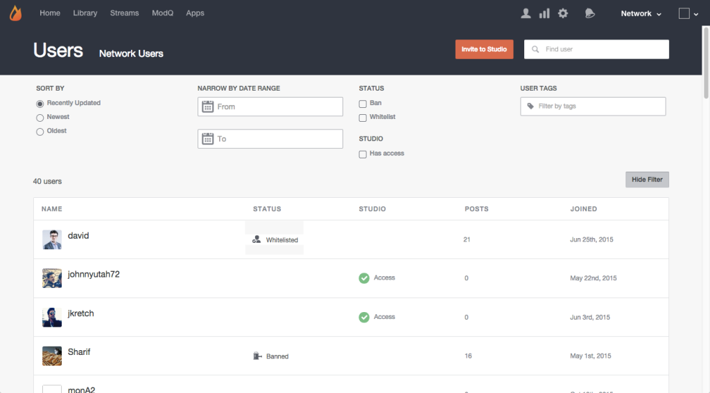

# Sök efter användare{#search-for-users}

Använd sökfältet högst upp på sidan för att söka efter webbplatsbesökare efter visningsnamn, användar-ID, e-postadress eller det datum då de anslöt till ditt Livefyre-nätverk.

>[!NOTE]
>
>Dessa fält har stöd för jokerteckensökning.

1. Klicka på **[!UICONTROL Show Filter]** för att öppna en panel där listade användare kan filtreras.
1. **[!UICONTROL Sort by]** uppdateringar av de listade användarkontona: Nyligen uppdaterat, nyaste eller äldsta.
1. **[!UICONTROL Narrow by Date Range]** om du bara vill visa användarkonton som lagts till under indataintervallet.
1. Visa endast **[!UICONTROL Banned]** eller **[!UICONTROL Whitelisted]** användare.
1. Visa endast **[!UICONTROL Studio]** användare.
1. Visa endast konton med **[!UICONTROL User Tags]** bifogade indata. 

